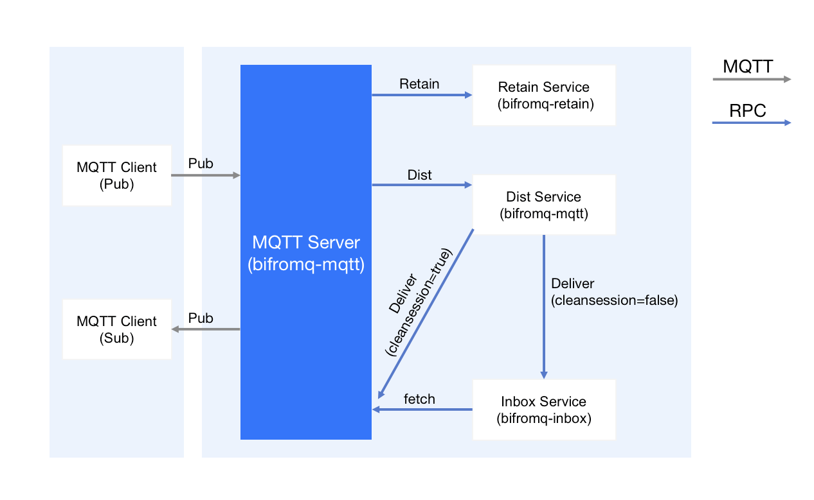
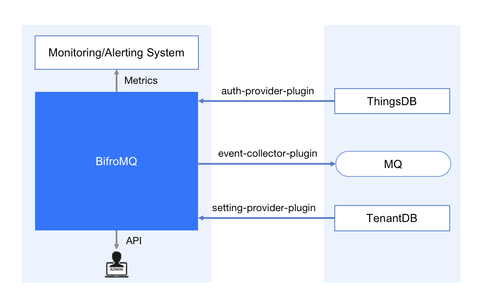

# BifroMQ Technical Architecture Overview

In today's IoT field, the MQTT protocol has become an indispensable key element, providing core technical support for efficient and real-time data transmission. However, projects that currently offer MQTT capabilities are mainly concentrated on traditional, existing "out-of-the-box" IoT device management platforms, leading to a lack of sufficient attention and exploration of the underlying MQTT protocol implementation. However, we firmly believe that the characteristics of the MQTT protocol have a broader application prospect, not limited to the IoT field. It is out of this belief that after years of practice and technical accumulation, we have launched the open-source project BifroMQ, focusing on the efficient processing of the MQTT protocol, especially in the face of large-scale loads.

<!--truncate-->

**Neutral and Scalable MQTT Protocol Middleware**

Compared to traditional IoT device management platforms, BifroMQ adheres to a different design philosophy. We boldly abandon the traditional paradigm of "one-size-fits-all solutions" and focus on the needs of high-performance MQTT protocols. We believe that the characteristics of the MQTT protocol have a broader application paradigm, so BifroMQ is committed to fully exploiting the potential of the MQTT protocol, especially in terms of excellent performance when handling large-scale loads.

Compared to integrating logic with downstream systems (such as Kafka) in MQTT implementations, BifroMQ prefers to "dock" with downstream systems in a way that complies with MQTT standards. For example, through the Shared Subscription mechanism, the integration logic is externalized to achieve more decoupled bridging and the ability to forward messages to heterogeneous systems while maintaining high message throughput. This design philosophy makes BifroMQ a highly customizable middleware that can easily adapt to various downstream systems to meet the needs of different business scenarios.

## Building Large-Scale Multi-Tenant Serverless Cloud Services

The mission of BifroMQ is to build an MQTT messaging system suitable for large-scale multi-tenant use to support the business characteristics of Serverless-type cloud services. This mission is driven by a deep understanding of the characteristics of the MQTT protocol and confidence in its broader application. Unlike traditional enterprise architectures, Serverless cloud services emphasize resource allocation on demand, elastic expansion, and highly flexible service construction. Therefore, BifroMQ, through its multi-tenant architecture and resource sharing mechanism, provides the feature of "shared resources, exclusive experience" for Serverless-type businesses.

## Enterprise Deployment: Flexibility and Robustness

Although the goal of BifroMQ is to build multi-tenant Serverless cloud services, multi-tenant + shared resources are essentially an abstraction of single-tenant exclusive resources. Consistent with our philosophy, BifroMQ easily supports common "Shared Nothing" enterprise-level cluster deployments through the free combination and configuration of core components. In fact, this is also the default deployment mode of the open-source version of BifroMQ. This flexibility allows BifroMQ to adapt to system architectures of various scales and needs.

## BifroMQ Architecture Analysis

The architectural design of BifroMQ is based on "first principles," analyzing the technologies needed to achieve design goals from a technical perspective and how to organically combine these technologies to achieve overall optimization. Therefore, it is difficult to fully understand its connotation just from the project structure and code logic. The following will describe the overall architecture of BifroMQ from three main angles.

### Modular Architecture Based on Decentralized Cluster Management

**Firstly**, apart from the implementation logic of the MQTT protocol itself, the various functional service modules of BifroMQ are built on a set of decentralized underlying cluster construction capabilities (base-cluster), as shown in the following figure:

Modular architecture of BifroMQ's decentralized cluster

The cluster logic constructed by base-cluster is logically divided into two layers: Underlay Cluster and Overlay Cluster. The Underlay Cluster is called the "Host" Cluster, and each Host in BifroMQ corresponds to a service process (Process) running on the operating system. The Host Cluster uses Gossip-like protocols (SWIM Protocol) to implement Host Membership and provides an abstract Host address for the Overlay Cluster. The Overlay Cluster is called the "Agent" Cluster, which provides an Agent-level address abstraction (Agent Address) based on the Host address. In BifroMQ, the Agent corresponds to a logical service (Service) that implements specific functions. These logical services (unifiedly implemented through the base-rpc framework) include client and server role modules, which use the capabilities of the Agent Cluster to achieve service registration and discovery.

The benefits of this architecture include:

1. Logical services are decoupled from the processes in which they are located, allowing for more flexible encapsulation and combination according to deployment scenarios.
2. The "service discovery" of logical services does not depend on traditional registration centers or name services, thereby eliminating the operational risk of single-point failures and allowing the cluster scale to freely expand.

### Modular Load Isolation and Collaboration

**Next**, we describe the structure of BifroMQ from the perspective of protocol implementation. When architecting from the perspective of building Serverless cloud services, it is necessary to consider the rationality of functional implementation from the perspective of load isolation and management, that is, the multi-tenancy of the load. We have split the workload of the MQTT protocol so that each type of load can exist in the form of an independent sub-cluster, and these sub-clusters build complete MQTT capabilities through collaboration. The following are the MQTT load-related modules in BifroMQ:

* bifromq-mqtt: Responsible for handling the long-connection load of the MQTT protocol
* bifromq-dist: Responsible for maintaining the high-reliability storage and large-scale message routing of MQTT subscription status
* bifromq-inbox: Responsible for the high-reliability storage of subscriber session messages in CleanSession=false mode
* bifromq-retain: Responsible for the high-reliability storage of Retain messages

The collaboration relationship between these modules is shown in the following figures:

BifroMQ Module Collaboration Relationship

It is worth mentioning that the bifromq-dist, bifromq-inbox, and bifromq-retain modules all make full use of the capabilities of base-kv to achieve distributed strong consistency persistence of key loads. In the operation and maintenance scenarios of Serverless cloud services, this is particularly important for ensuring SLA.

### Neutrality: Standard-Oriented and Scalable Integration

As mentioned earlier, the positioning of BifroMQ is to implement MQTT standard middleware, emphasizing neutrality and integrability more. It is not on the same level as other projects that include MQTT capabilities as part of a "one-size-fits-all IoT platform."

Therefore, the standard for judging "whether BifroMQ has a certain function or will support a certain function in the future?" is very simple: all capabilities defined by the MQTT protocol belong to the scope that the BifroMQ project needs to support, and all functions that exceed the definition of the MQTT protocol, we prefer to exist as independent components or services, and integrate with BifroMQ in a way that complies with MQTT standards. This method helps to build larger-scale cloud services and promote the maturity of related technologies.

Of course, the integrability of BifroMQ is also reflected in the integration of the middleware itself with various business systems, mainly including three mechanisms: Plugin, API, and Metrics:

Typical Scenario Integration Architecture

* The Plugin mechanism is the main way to implement business logic integration. bifromq currently defines the following plugin interface modules:
  * bifromq-plugin-auth-provider: Implement client authentication and Pub/Sub authorization logic based on message topics
  * bifromq-plugin-event-collector: Implement business logic triggered by various MQTT-related events
  * bifromq-plugin-setting-provider: Implement tenant-level runtime setting change management logic

* Reference implementations of these interfaces can be found in the BifroMQ-Inside project.
* The API mechanism (coming soon) provides BifroMQ's runtime HTTP management interface, implementing basic management operations such as server-side subscription management and disconnection.
* The Metrics mechanism implements metric definition and sampling through the use of the micrometer library, but does not limit the type of collector, allowing business integration parties to customize (you can refer to the build-plugin-demo module in the project).

### Summary

In summary, this is an overall introduction to the technical architecture of BifroMQ. Please look forward to a series of special articles that we will publish next, to explore the various components and design principles of BifroMQ in depth. At the same time, you are welcome to join the BifroMQ Discord  .
