## Test Objectives

BifroMQ Standard mode now supports cluster deployment, with significant performance variations observed across different
usage scenarios and configurations.

The purpose of this report is to present the performance metrics and results analysis for BifroMQ in the standard
cluster deployment mode, across various common usage scenarios. This analysis aims to provide users with references for
cluster deployment, specification evaluation, parameter configuration, and other related aspects.

## Test Environment

### Load Testing Tool

A testing tool developed based on vertx-mqtt, it offers flexible usage and excellent performance. It will be
open-sourced in the near future.

### Deployment Machine Specifications

BifroMQ Deployment Machine: CentOS release 7.6, 32 cores, 128GB RAM (JVM allocated memory: 40GB)
Load Testing Machine: CentOS release 7.6, 16 cores, 128GB RAM (JVM allocated memory: 32GB)

### Cluster Configuration and Setup Steps

BifroMQ comes with built-in message routing and persistent message storage engine, making it a stateful service.
Therefore, when building the cluster for the first time, a specific sequence needs to be followed.

Below is an example of setting up a three-node cluster.

node1: 192.168.0.11

node2: 192.168.0.12

Node3: 192.168.0.13

Modify the standalone.yml file in the conf folder.

Here is the minimal configuration for node 1:

```ymal
bootstrap: true

mqttServerConfig:
  tcpListener:
    port: 1883

clusterConfig:
  env: Test
  host:
  port: 8899
  clusterDomainName:
  seedEndpoints: 192.168.0.11:8899,192.168.0.12:8899,192.168.0.13:8899
```

For node 2 and node 3 in the standalone.yml file:

```ymal
bootstrap: false

mqttServerConfig:
  tcpListener:
    port: 1883

clusterConfig:
  env: Test
  host:
  port: 8899
  clusterDomainName:
  seedEndpoints: 192.168.0.11:8899,192.168.0.12:8899,192.168.0.13:8899
```

the cluster nodes (node1, node2, and node3) should be started sequentially in the following order: node1 first, then
node2, and finally node3.

Note: During the entire lifecycle of the cluster, the bootstrap configuration needs to be set to true only during the
initial startup of the first node. This is necessary for initializing the persistent storage metadata. Subsequent
configurations and the order of startup do not require attention to this setting.

## Test Instructions

### Scene Introduction

Introduction to Test Dimensions：

* `cleanSession`: true | false, corresponding to the Clean Session flag in the MQTT protocol during connection
  establishment. When set to false, it indicates support for offline subscriptions and message persistence.
* `Pub & Sub Ratios`:
    * `1-to-1`: Signifying that each message sent by a publisher client is received by only one subscribing client.
    * `Shared Subscriptions`: Indicating that messages from multiple publisher clients are shared among n subscribing
      clients, with each client receiving 1/n portion of the messages.
    * `Fan-out Subscriptions`: Signifying that messages from one publisher client are received by a larger number of
      subscribing clients, akin to broadcasting.
* `QoS: 0 | 1`:  denoting the Quality of Service level for both publishing messages and subscribing to topics.
* `Payload Size`: The size of each test message, measured in bytes.
* `Single Connection Message Frequency`:
    * Low frequency: Implies one message sent per second by each publishing connection.
    * High frequency: Indicates 50 to 100 messages sent per second by each publishing connection.

Tests for various scenarios are derived from the combinations of the above dimensions.

***Note: By default, the input/output bandwidth for a single connection is limited to 512KB/s. Exceeding this bandwidth
limit may cause message delays. This restriction primarily serves as a system safeguard rather than a performance
bottleneck and can be modified using configuration parameters during startup.***

### cleanSession=true and false

BifroMQ provides comprehensive support for the MQTT protocol, particularly concerning session persistence. The server
persistently stores all client subscription information as well as messages with various QoS levels for clients
with `cleanSession=false`. Therefore, there are significant differences in how connections and messages are handled
between `cleanSession=true` and `cleanSession=false`.

BifroMQ adopts a persistence strategy based on disk storage rather than memory. This ensures that data is not lost in
case of crashes or reboots. In cluster mode, the number of replicas for persisting data can be configured based on
specific requirements, further enhancing data high availability.

Due to this design, connections with `cleanSession=false` consume more resources compared to `cleanSession=true`, and
they continue to occupy system resources even when offline. Consequently, the performance metrics achievable under the
same deployment specifications can vary significantly between `cleanSession=true` and `cleanSession=false`. It is
essential to choose the appropriate setting based on specific requirements and usage scenarios.

***Note: BifroMQ's offline persistence design is intended to ensure service level agreements (SLA) rather than serving
as a storage engine. Therefore, unconventional usage contrary to the protocol should be avoided. For instance,
in `cleanSession=false` mode, using different clientIds for each connection not only fails to utilize offline
persistence effectively but also introduces additional burden to the system due to the presence of dirty data.***

### Factors Affecting Persistent Message Performance

In the clustered deployment of BifroMQ, the storage engine also forms a distributed cluster. BifroMQ's storage engine is
based on the RAFT protocol's multi-replica architecture, supporting multiple shards.

Within each BifroMQ instance, there are three independent storage engines responsible for storing subscription
information, messages from connections with `cleanSession=false`, and retained messages. Each storage engine can be
configured separately. For messages from connections with `cleanSession=false`, the number of shards and replicas
significantly impact performance.

The number of replicas for the persistent message storage engine can be configured at startup with a system
variable (`inbox_store_replica_voter_count`, as detailed in the configuration manual), with a default of 1. To maintain
high availability, the number of replicas should be greater than or equal to 3.

***Note: Increasing the number of replicas will amplify the amount of written data, leading to increased consumption of
system resources and message latency.***

The multiple shards in the storage engine are implemented based on the Multi-RAFT protocol. Each shard and its replicas
form a RAFT replication cluster. Until the system resource bottleneck is reached, increasing the number of shards
appropriately can effectively enhance the storage engine's write and query efficiency.

The persistent message storage engine incorporates a load-based automated sharding strategy. Each shard decides whether
to split based on the current read-write load and system busyness. Generally, no additional configuration is required.
For users with an in-depth understanding of BifroMQ's code and sharding principles, optimization can be performed by
attaching the following system variables at startup:

- `inbox_store_io_nanos_limit`: Storage engine IO latency limit, defaulting to 30,000 nanoseconds. Splitting pauses when
  internal read-write latency exceeds this value.
- `inbox_store_max_io_density`: Storage engine IO density threshold. Sharding planning begins when the real-time load
  statistics of the current shard exceed this limit.

Sharding strategies are loaded and configured through a plugin mechanism. Advanced users can develop sharding strategies
tailored to their specific scenarios.

## Test Report

### Parameter Description

The scenario names are derived from the combination of various dimensional parameters in the test cases. For
example, `30k_30k_qos1_p256_1mps_3n_3v` signifies:

* 30,000 Pub MQTT clients

* 30,000 Sub MQTT clients

* Messages and subscriptions use QoS1

* Individual message payload size of 256 bytes

* Each Pub client sends 1 message per second to BifroMQ, forwarded to Sub clients

* 3n indicates the deployment of three BifroMQ nodes

* 3v represents three copies of data stored in the persistence engine, primarily affecting the `cleanSession=false`
  scenario

### Results Analysis and Explanation

1. In the high-frequency scenario with `cleanSession=true`, the total throughput of messages (sum of messages sent by
   pub clients and received by sub clients) can reach over 400,000 messages per second (40W/s) for a single node. In a
   three-node deployment, the message throughput can even exceed 1,000,000 messages per second (100W/s). In
   low-frequency scenarios, the message throughput for a single node can reach a maximum of over 200,000 messages per
   second (20W/s), and in a three-node deployment, it can reach over 600,000 messages per second (60W/s). Throughput can
   be horizontally scaled by increasing the number of nodes.

*Note: To achieve the predetermined throughput in low-frequency scenarios, a larger number of connections need to be
maintained, consuming more service resources. Therefore, the achievable upper limit of throughput in low-frequency
scenarios may be reduced compared to high-frequency sending scenarios.*

2. In the `cleanSession=true` scenario, the shared subscription and fan-out capabilities can be horizontally scaled by
   increasing the number of nodes.

3. In the high-frequency scenarios with `cleanSession=false`, the message throughput for a single node can reach over
   30,000 messages per second, and in a three-node deployment with a single replica, the message throughput can reach
   over 90,000 messages per second. In low-frequency scenarios, the message throughput for a single node can reach over
   20,000 messages per second, and in a three-node deployment with a single replica, the message throughput can reach
   over 60,000 messages per second. This achieves basic horizontal scalability.
4. In the `cleanSession=false` scenario with a three-node, three-replica deployment, both high-frequency and
   low-frequency message throughputs can reach over 30,000 messages per second, similar to the single-node
   single-replica deployment scenario. This is because deploying three replicas amplifies the load of persistent message
   writes threefold, allowing three nodes to handle a threefold load, similar to what a single node with a single
   replica can support. To extend the message throughput capacity of `cleanSession=false` with multiple replica
   deployments, calculations based on the above patterns can be made to determine the appropriate number of nodes and
   replicas for deployment sets.
5. System throughput and latency metrics are influenced by message and subscription QoS levels. Under the same test
   load, QoS1 scenarios consume slightly more system resources than QoS0 scenarios and may experience a slight increase
   in message latency, typically on the millisecond level. This difference is observable only under high throughput and
   system load conditions.
6. There is a multiple-fold difference in performance between `cleanSession=false` and `cleanSession=true` scenarios.
   This is because BifroMQ's architecture is designed to build serverless cloud services, where the reliability of
   offline messages is a critical indicator of cloud service SLA. Therefore, BifroMQ chose a persistence strategy based
   on disk storage instead of memory. Data loss will not occur in the event of a crash or restart. The performance of
   the storage engine is limited by the local disk IO performance of the current test machine. Performance can be
   improved by replacing high-performance disks or using appropriate load balancing strategies in a cluster environment.
7. The p99 and max views in the result graphs may have occasional spikes, this is related to the implementation of the test
   pressure end (Java GC).
8. BifroMQ's internal message links are implemented asynchronously, fully utilizing the multi-core capabilities of the
   CPU. The testing scenarios listed in this report are stress tests and have a relatively high level of system load.
   Therefore, message latency metrics may increase. Under no load, BifroMQ can keep message latency to around 1ms.
   Moreover, in an environment with a higher number of available CPU cores, BifroMQ can achieve higher throughput and
   lower latency metrics than those reported in this document.

### cleanSession=true

#### High-frequency Scenarios

| Scenario combinations | QoS | Single connection frequency(m/s) | Payload (byte) | Connection number | Total frequency (m/s) | average response time(ms) | P99 response time(ms) | CPU | Memory (GB) |
|--------------------------|-----|--------|---------------|------|--------|---------------------------|-----------------------|-----|--------------------------|
| 2k_2k_qos0_p32_100mps_1n | 0   | 100    | 32            | 4k   | 200k   | 3.12                | 15.91          | 80% | 5 ~ 10 |
| 1.5k_1.5k_qos1_p32_100mps_1n | 1 | 100 | 32 | 3k | 150k | 14.67 | 83.88 | 85% | 5 ~ 10 |
| 5k_5k_qos0_p32_100mps_3n | 0 | 100 | 32 | 10k | 500k | 7.58                 | 35.03          | 85% | 5 ~ 10 |
| 4k_4k_qos1_p32_100mps_3n | 1 | 100 | 32 | 8k | 400k | 13.12              | 55.85          | 85% | 5 ~ 10 |

2k_2k_qos0_p32_100mps_1n scenario charts：

 | 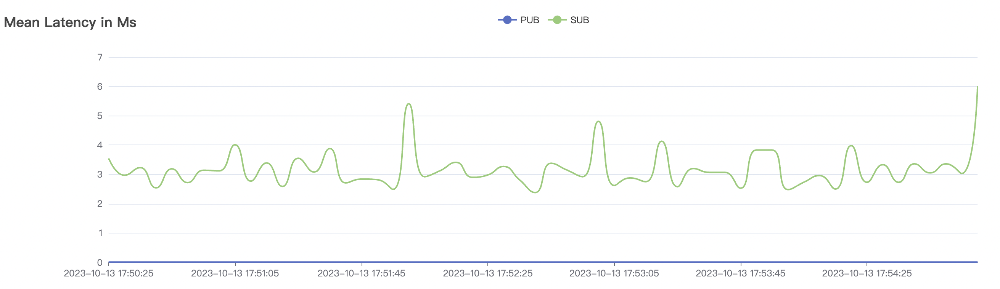
------------------------------------------------------------ | ------------------------------------------------------------
 | 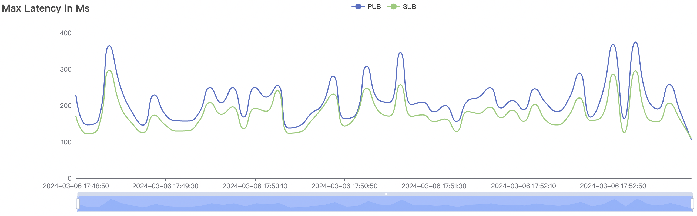
 | 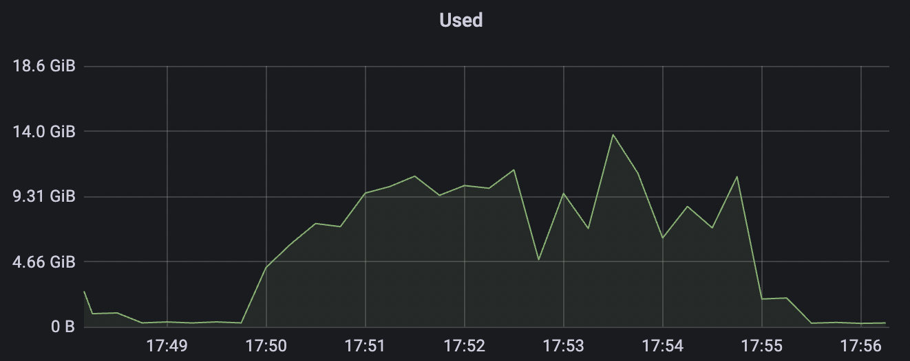

1.5k_1.5k_qos1_p32_100mps_1n scenario charts：

 | 
------------------------------------------------------------ | ------------------------------------------------------------
 | 
 | 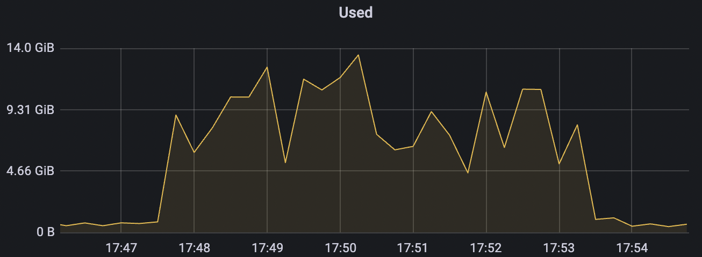

5k_5k_qos0_p32_100mps_3n scenario charts：

 | 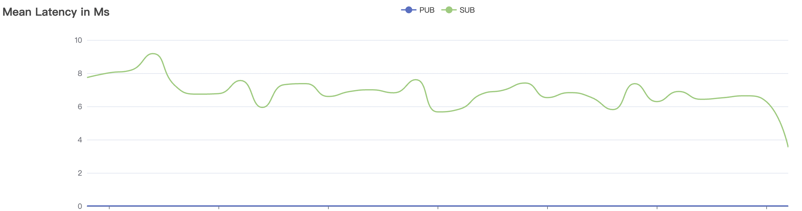
------------------------------------------------------------ | ------------------------------------------------------------
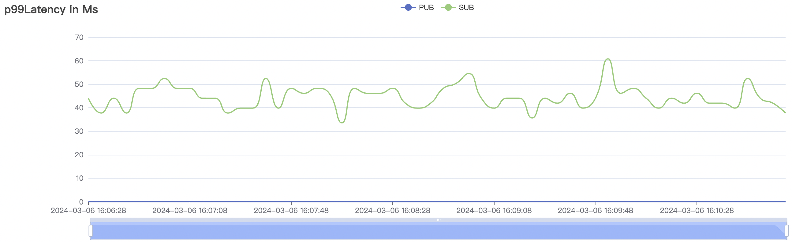 | 
 | 

4k_4k_qos1_p32_100mps_3n scenario charts：

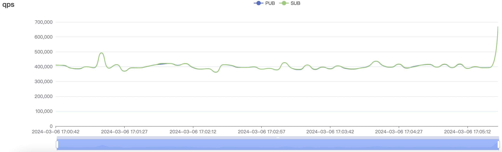 | 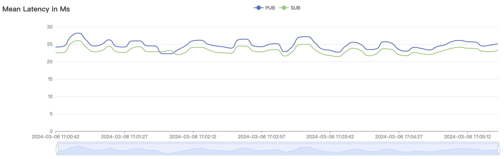
------------------------------------------------------------ | ------------------------------------------------------------
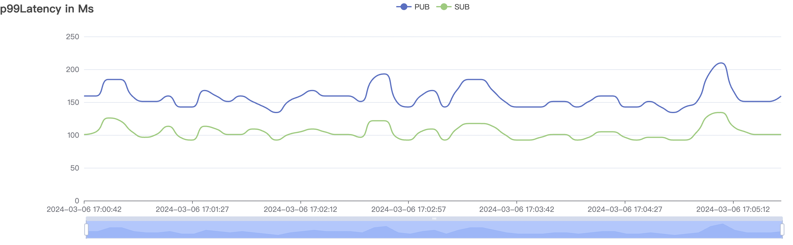 | 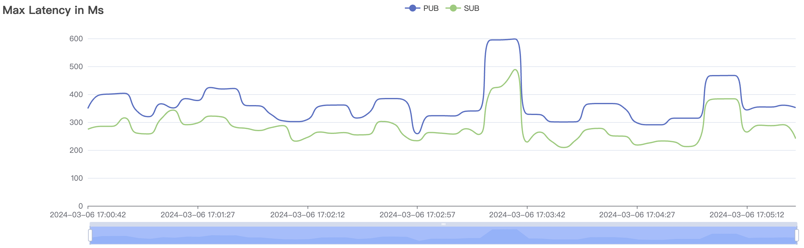
 | 

#### Low-frequency Scenarios

| Scenario combinations | QoS | Single connection frequency(m/s) | Payload (byte) | Connection number | Total frequency (m/s) | average response time(ms) | P99 response time(ms) | CPU | Memory (GB) |
| --------------------------- | ---- | --------- | -------- | ------- | --------- |---------------------------| ------------- | ---- | ---------- |
| 100k_100k_qos0_p256_1mps_1n | 0    | 1         | 256      | 200k    | 100k      | 5.72                  | 52.42  | 80% | 8 ~ 15   |
| 100k_100k_qos1_p256_1mps_1n | 1    | 1         | 256      | 200k    | 100k      | 59.15                 | 318.75  | 88% | 8 ~ 15    |
| 250k_250k_qos0_p256_1mps_3n | 0    | 1         | 256      | 500k   | 250k    | 17.96                     | 113.23                | 85% | 8 ~ 15 |
| 200k_200k_qos1_p256_1mps_3n | 1    | 1         | 256      | 400k    | 200k      | 12.8 | 100.65 | 85%  | 7 ~ 12     |

100k_100k_qos0_p256_1mps_1n scenario charts：

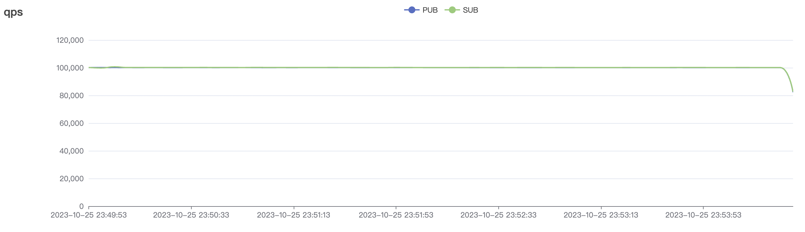 | 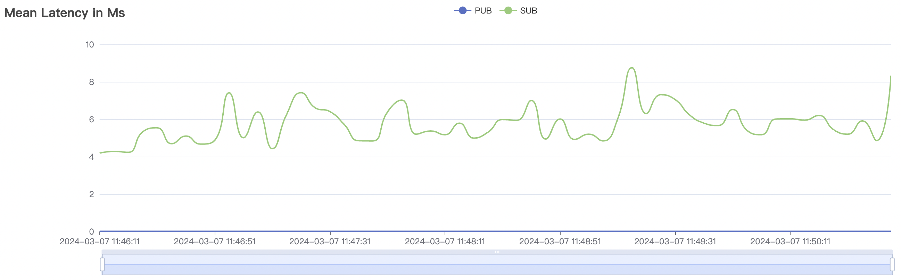
------------------------------------------------------------ | ------------------------------------------------------------
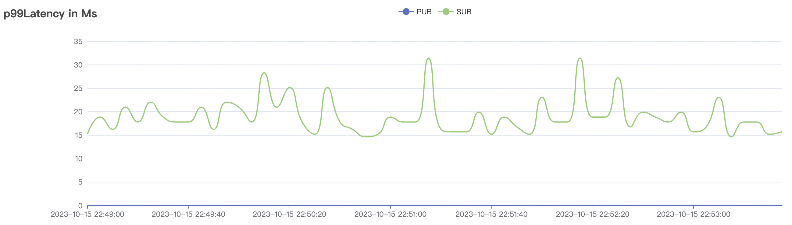 | 
 | 

100k_100k_qos1_p256_1mps_1n scenario charts：

 | 
------------------------------------------------------------ | ------------------------------------------------------------
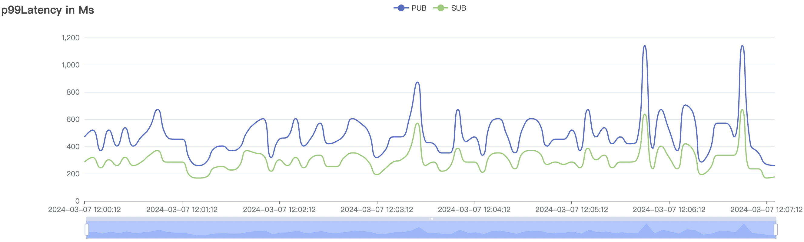 | 
 | 

250k_250k_qos0_p256_1mps_3n scenario charts：

 | 
------------------------------------------------------------ | ------------------------------------------------------------
 | 
 | 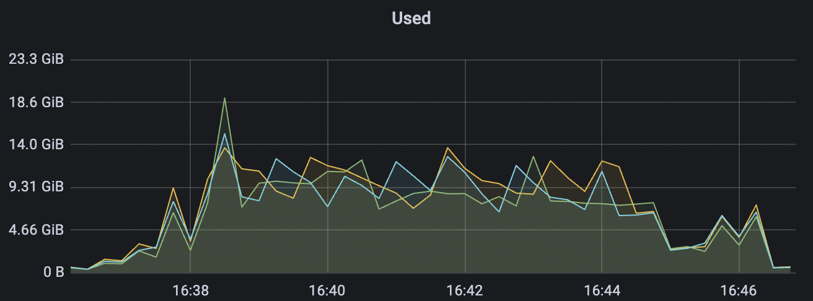

#### Shared Subscriptions Scenario

| Scenario combinations | QoS | Single connection frequency(m/s) | Payload (byte) | Connection number | Total frequency (m/s) | average response time(ms) | P99 response time(ms) | CPU | Memory (GB) |
| --------------------------- | ---- | --------- | -------- | ------- | --------- | -------------- | ------------- | ---- | ---------- |
| 100k_1000_qos0_p256_1mps_1n | 0    | 1         | 256      | 101k    | 100k      | 1.53         | 13.62     | 78% | 6 ~ 12   |
| 100k_1000_qos1_p256_1mps_1n | 1    | 1         | 256      | 101k    | 100k      | 6.52       | 56.61    | 82% | 6 ~ 12  |
| 300k_3000_qos0_p256_1mps_3n | 0    | 1         | 256      | 303k    | 300k      | 5.18       | 30.39    | 82% | 7 ~ 12 |
| 200k_2000_qos1_p256_1mps_3n | 1    | 1         | 256      | 202k    | 200k      | 11.34    | 83.88  | 78% | 7 ~ 16  |

100k_1000_qos0_p256_1mps_1n scenario charts：

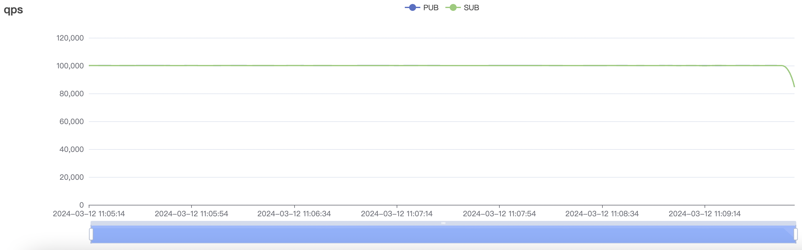 | 
------------------------------------------------------------ | ------------------------------------------------------------
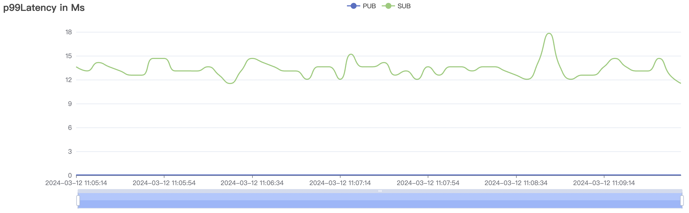 | 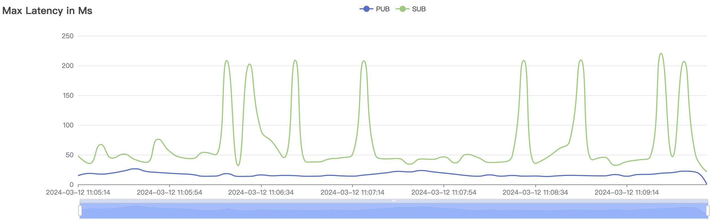
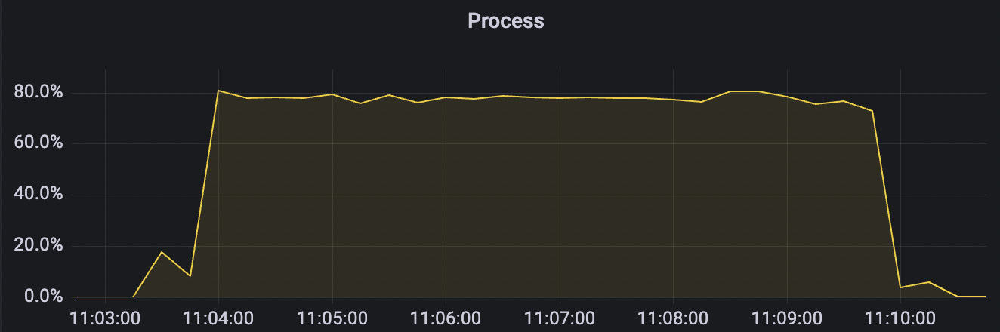 | 

100k_1000_qos1_p256_1mps_1n scenario charts：

 | 
------------------------------------------------------------ | ------------------------------------------------------------
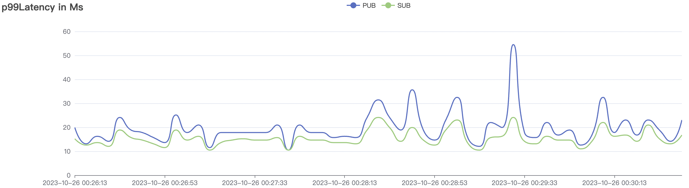 | 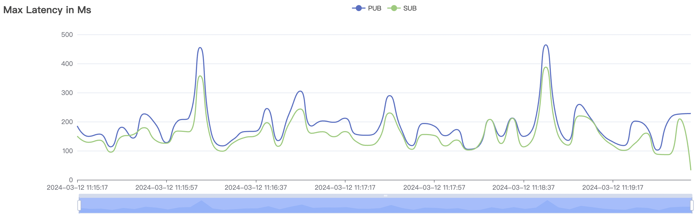
 | 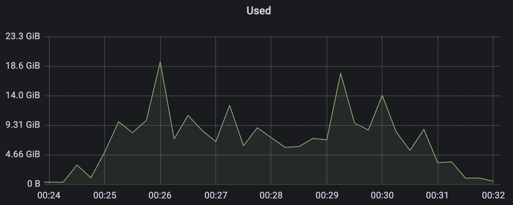

300k_3000_qos0_p256_1mps_3n scenario charts：

 | 
------------------------------------------------------------ | ------------------------------------------------------------
 | 
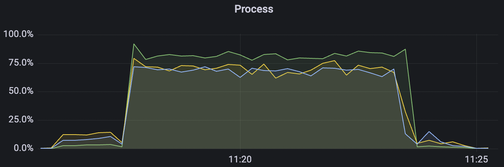 | 

200k_2000_qos1_p256_1mps_3n scenario charts：

 | 
------------------------------------------------------------ | ------------------------------------------------------------
 | 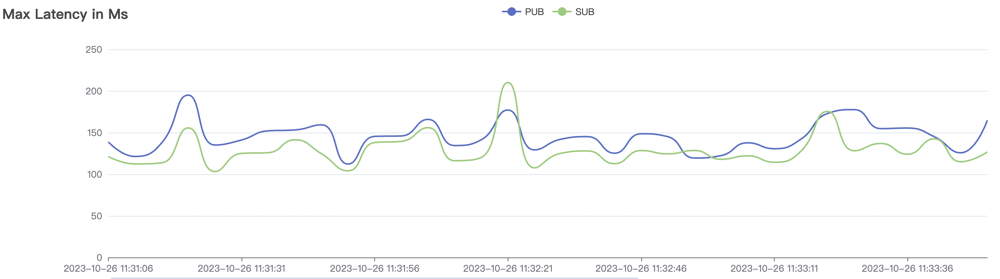
 | 

#### Fan-out Subscriptions Scenario

Few clients act as Publishers, and a large number of clients subscribe to the same topic as Subscribers, creating a
scenario where each message is widely fan-out broadcast.

| Scenario combinations | QoS | Single connection frequency(m/s) | Payload (byte) | Connection number | Total frequency (m/s) | average response time(ms) | P99 response time(ms) | CPU | Memory (GB) |
| -------------------------- | ---- | --------- | -------- | ------- | --------- | -------------- | ------------- | ---- | ---------- |
| 1_100000_qos0_p256_1mps_1n | 0    | 1         | 256      | 100k    | 100k      | 119.09   | 226.46  | 20% | 2 ~ 7 |
| 1_100000_qos1_p256_1mps_1n | 1    | 1         | 256      | 100k    | 100k      | 186.05 | 352.26   | 20%  | 2 ~ 9     |
| 1_300000_qos0_p256_1mps_3n | 0    | 1         | 256      | 300k    | 300k      | 237.33   | 570.36  | 15% | 2 ~ 6    |
| 1_200000_qos1_p256_1mps_3n | 1    | 1         | 256      | 200k    | 200k      | 249.58   | 570.36  | 20% | 3~ 6     |

1_100000_qos0_p256_1mps_1n scenario charts：

|  |  |
| ------------------------------------------------------------ | ------------------------------------------------------------ |
|  | 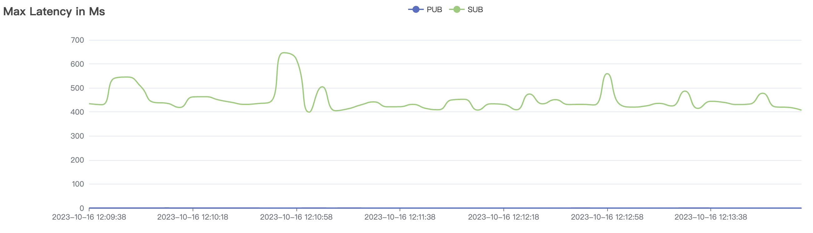 |
|  |  |

1_100000_qos1_p256_1mps_1n scenario charts：

| 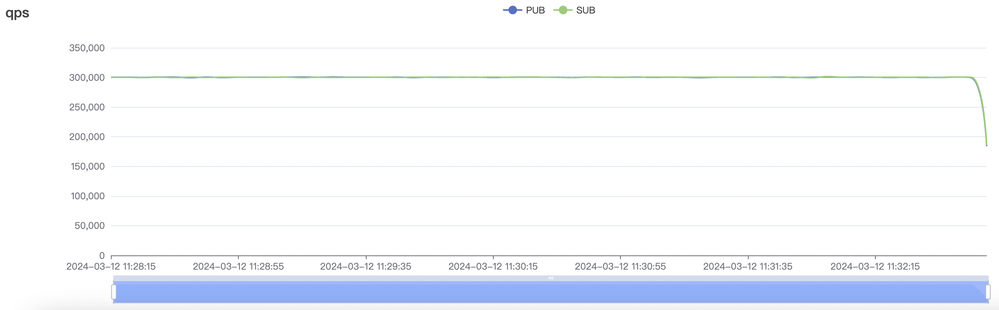 |  |
| ------------------------------------------------------------ | ------------------------------------------------------------ |
|  |  |
|  | 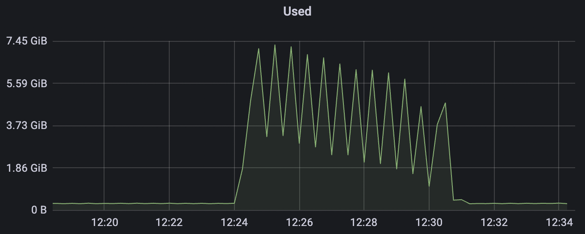 |

1_300000_qos0_p256_1mps_3n scenario charts：

|  |  |
| ------------------------------------------------------------ | ------------------------------------------------------------ |
|  | 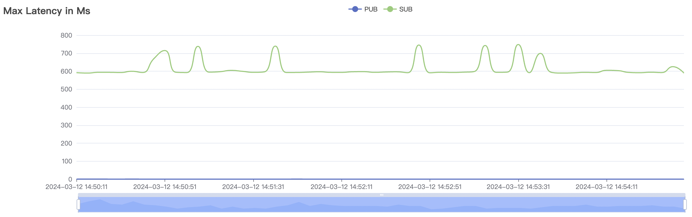 |
|  |  |

1_200000_qos1_p256_1mps_3n scenario charts：

| 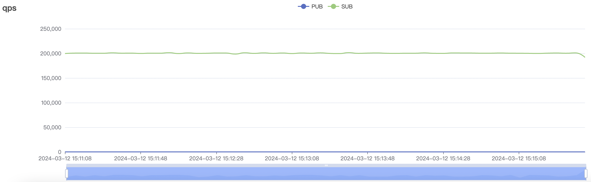 |  |
| ------------------------------------------------------------ | ------------------------------------------------------------ |
|  |  |
|  | 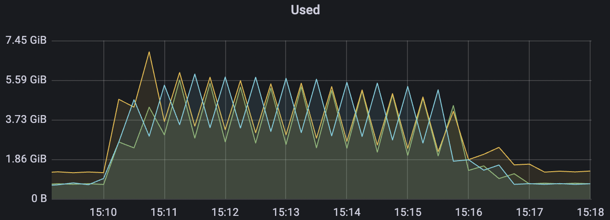 |

### cleanSession=false

#### Low-frequency Scenarios

| Scenario combinations | QoS | Single connection frequency(m/s) | Payload (byte) | Connection number | Total frequency (m/s) | average response time(ms) | P99 response time(ms) | CPU | Memory (GB) |
| ---------------------------- | ---- | --------- | -------------- | ------- | --------- | -------------- | ------------- | ---- | ---------- |
| 15k_15k_qos0_p256_1mps_1n_1v | 0    | 1         | 256            | 20k     | 15k       | 6.35                      | 134.18                | 50%  | 5~20        |
| 15k_15k_qos1_p256_1mps_1n_1v | 1    | 1         | 256            | 20k     | 15k       | 5.75       | 113.21 | 60% | 5~20     |
| 30k_30k_qos0_p256_1mps_3n_1v | 0    | 1         | 256            | 60k     | 30k       | 15.68     | 234.85  | 60%  | 5~20       |
| 30k_30k_qos1_p256_1mps_3n_1v | 1    | 1         | 256            | 60k     | 30k       | 22.75      | 285.18  | 70% | 5~18    |
| 15k_15k_qos0_p256_1mps_3n_3v | 0    | 1         | 256            | 30k     | 15k       | 9.0       | 133.15 | 50% | 5~18     |
| 15k_15k_qos1_p256_1mps_3n_3v | 1    | 1         | 256            | 30k     | 15k       | 9.75      | 134.15  | 50% | 5~20       |

15k_15k_qos0_p256_1mps_1n_1v scenario charts：

|  |  |
| ------------------------------------------------------------ | ------------------------------------------------------------ |
|  |  |
| 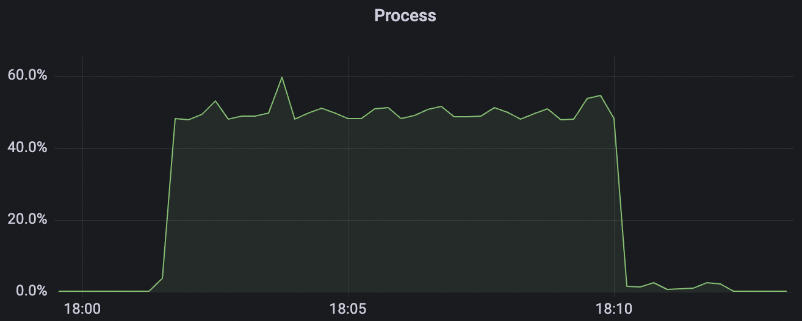 |  |

15k_15k_qos1_p256_1mps_1n_1v scenario charts：

| 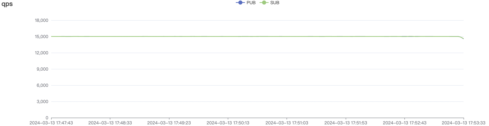 | 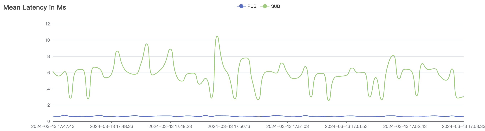 |
| ------------------------------------------------------------ | ------------------------------------------------------------ |
| 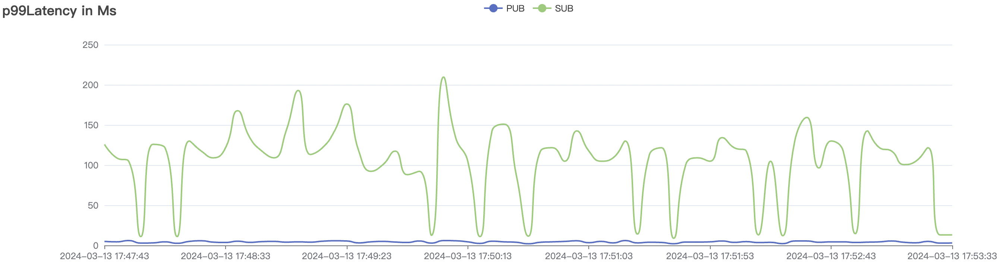 |  |
| 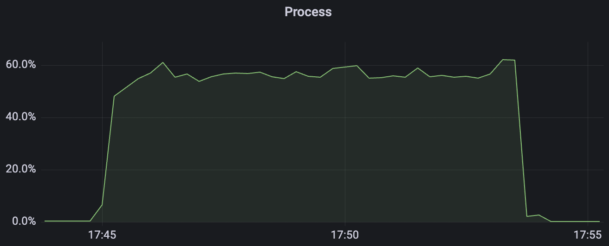 | 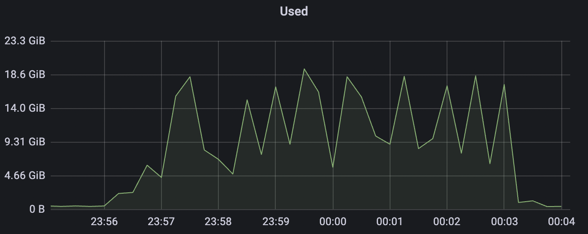 |

30k_30k_qos0_p256_1mps_3n_1v scenario charts：

|  | 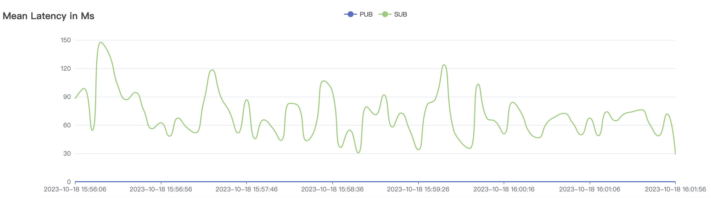 |
| ------------------------------------------------------------ | ------------------------------------------------------------ |
| 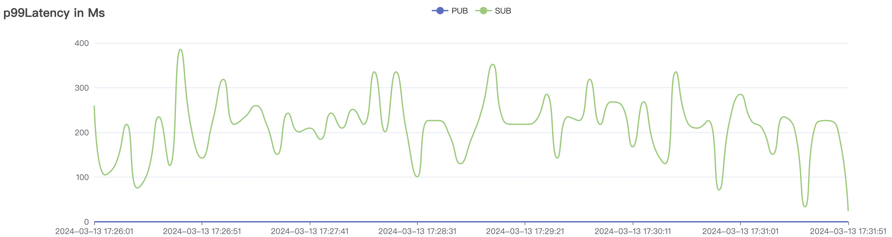 |  |
|  |  |

30k_30k_qos1_p256_1mps_3n_1v scenario charts：

|  | 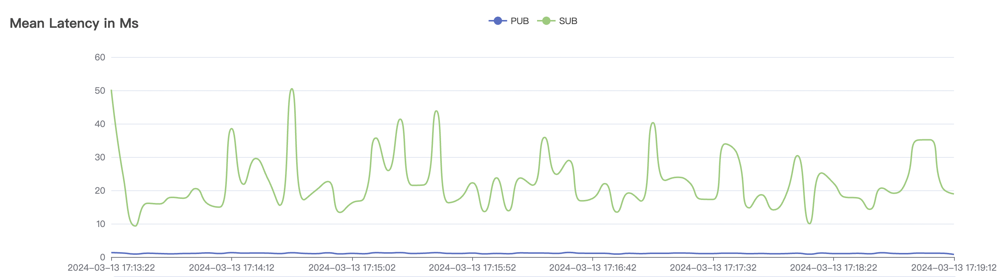 |
| ------------------------------------------------------------ | ------------------------------------------------------------ |
|  |  |
|  |  |

15k_15k_qos0_p256_1mps_3n_3v scenario charts：

|  | 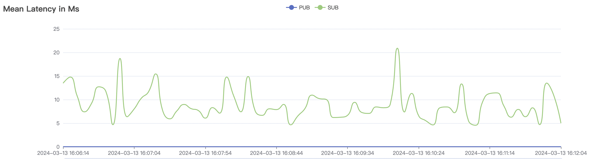 |
| ------------------------------------------------------------ | ------------------------------------------------------------ |
|  | 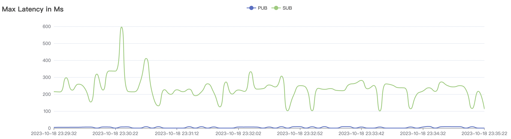 |
|  |  |

15k_15k_qos1_p256_1mps_3n_3v scenario charts：

|  | 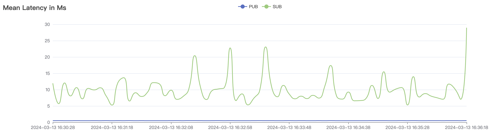 |
| ------------------------------------------------------------ | ------------------------------------------------------------ |
|  |  |
|  | 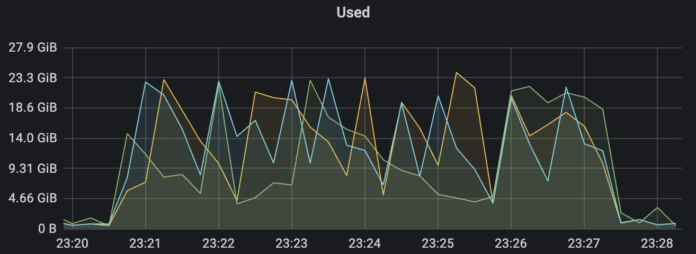 |

#### High-frequency Scenarios

| Scenario combinations | QoS | Single connection frequency(m/s) | Payload (byte) | Connection number | Total frequency (m/s) | average response time(ms) | P99 response time(ms) | CPU | Memory (GB) |
| ---------------------------- | ---- | --------- | -------------- | ------- | --------- | -------------- | ------------- | ---- | ---------- |
| 300_300_qos0_p32_50mps_1n_1v | 0    | 50        | 32             | 0.6k    | 15k       | 6.58 | 129.99 | 45% | 5~15      |
| 300_300_qos1_p32_50mps_1n_1v | 1    | 50        | 32             | 0.6k    | 15k       | 10.21      | 234.85    | 50% | 5~15       |
| 900_900_qos0_p32_50mps_3n_1v | 0    | 50        | 32             | 1.8k    | 45k       | 26.16 | 402.62 | 65% | 5~20     |
| 900_900_qos1_p32_50mps_3n_1v | 1    | 50        | 32             | 1.8k    | 45k       | 35.39 | 419.4 | 70% | 5~20       |
| 300_300_qos0_p32_50mps_3n_3v | 0    | 50        | 32             | 0.6k    | 15k       | 29.79 | 385.81   | 35% | 5~20     |
| 300_300_qos1_p32_50mps_3n_3v | 1    | 50        | 32             | 0.6k    | 15k       | 22.21     | 318.7    | 40% | 5~15       |

300_300_qos0_p32_50mps_1n_1v scenario charts：

|  | 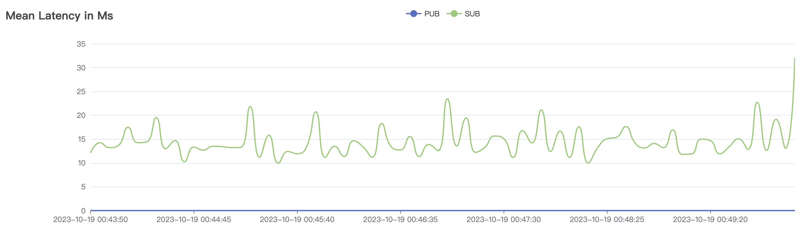 |
| ------------------------------------------------------------ | ------------------------------------------------------------ |
|  |  |
|  | 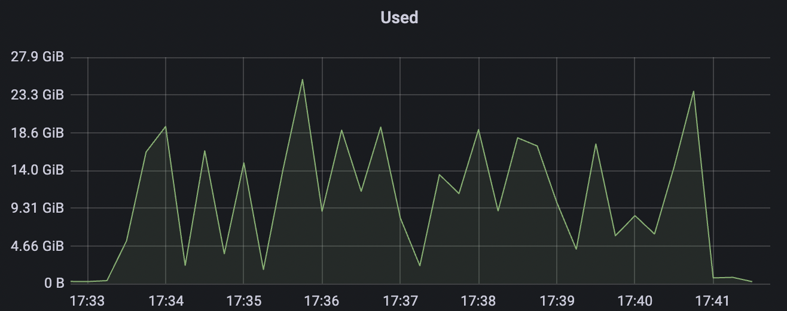 |

300_300_qos1_p32_50mps_1n_1v scenario charts：

|  |  |
| ------------------------------------------------------------ | ------------------------------------------------------------ |
|  |  |
| 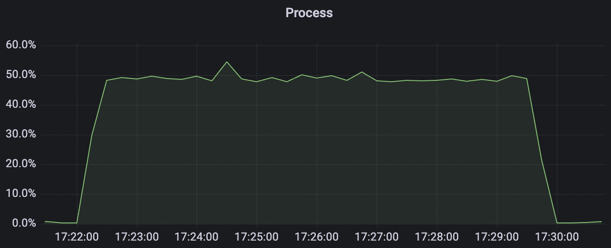 | 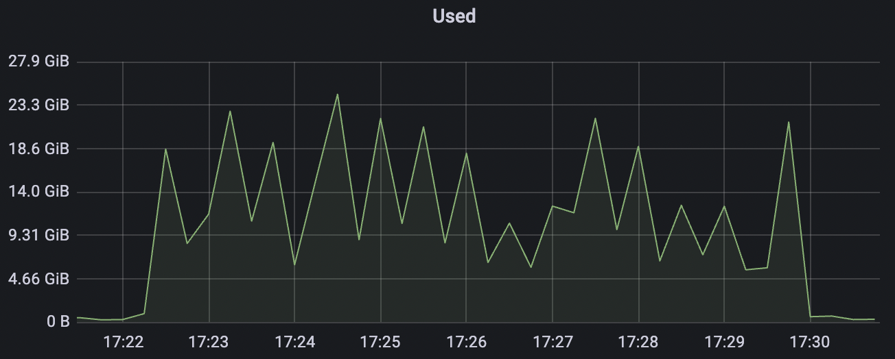 |

900_900_qos0_p32_50mps_3n_1v scenario charts：

|  | 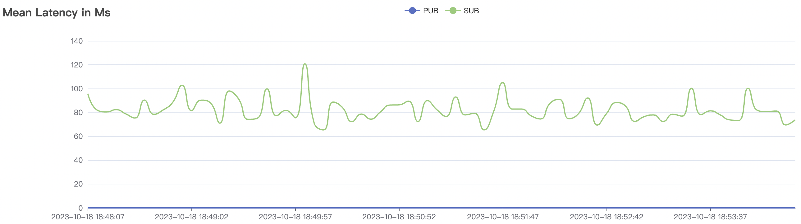 |
| ------------------------------------------------------------ | ------------------------------------------------------------ |
|  | 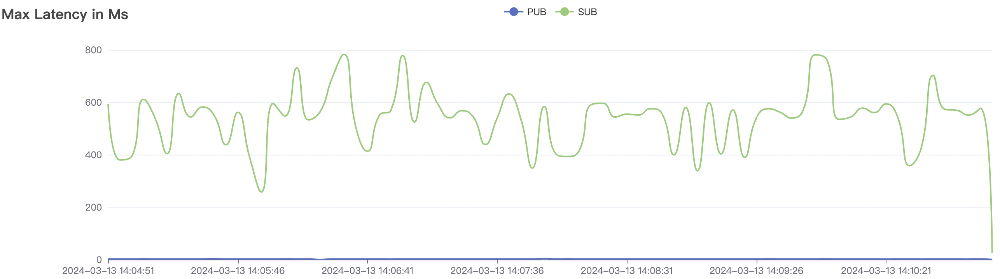 |
|  | 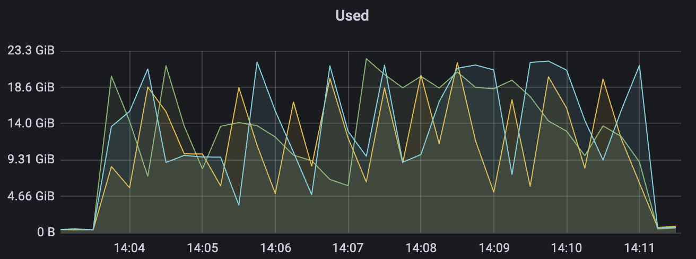 |

900_900_qos1_p32_50mps_3n_1v scenario charts：

|  |  |
| ------------------------------------------------------------ | ------------------------------------------------------------ |
|  |  |
|  |  |

300_300_qos0_p32_50mps_3n_3v scenario charts：

| 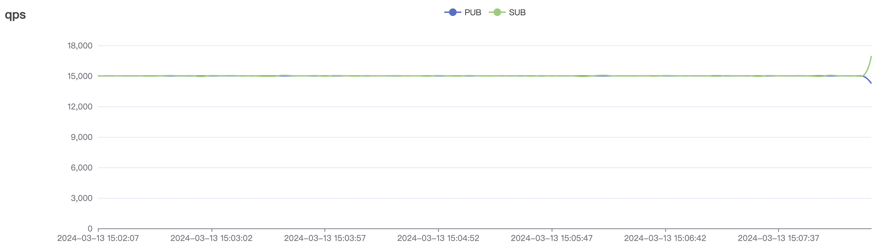 |  |
| ------------------------------------------------------------ | ------------------------------------------------------------ |
|  |  |
| 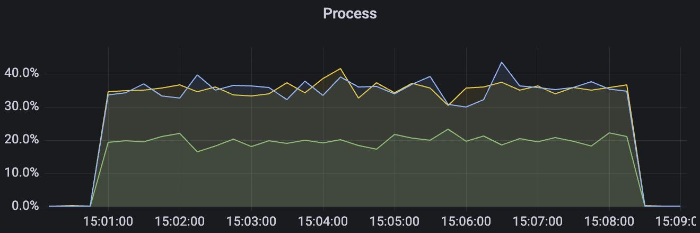 |  |

300_300_qos1_p32_50mps_3n_3v scenario charts：

| 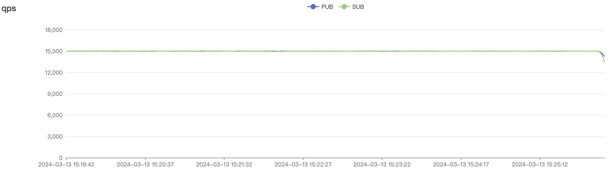 |  |
| ------------------------------------------------------------ | ------------------------------------------------------------ |
|  |  |
|  | 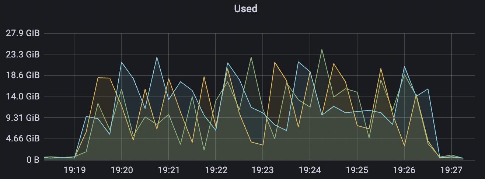 |

#### Cold start scenario

Cold start refers to initiating tests with a heavy load on cleanSession=false immediately after the cluster starts. At
this point, the internal storage engine within the cluster begins sharding in response to the pressure. Once an
appropriate number of shards is achieved, it stabilizes and operates steadily.

| Scenario combinations                     | QoS  | Single connection frequency(m/s) | Payload (byte) | Connection number | Total frequency (m/s) |
| ---------------------------- | ---- | --------- | -------------- | ------- | --------- |
| 30k_30k_qos1_p256_1mps_3n_1v | 1    | 1         | 256            | 60k     | 30k       |

cold start scenario charts：

| 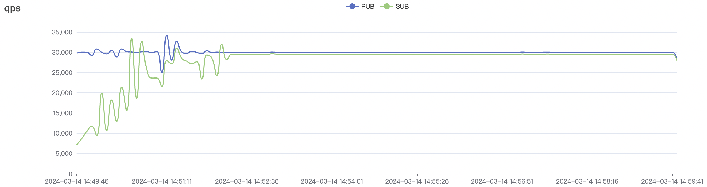 |  |
| ------------------------------------------------------------ | ------------------------------------------------------------ |
|  |  |
| 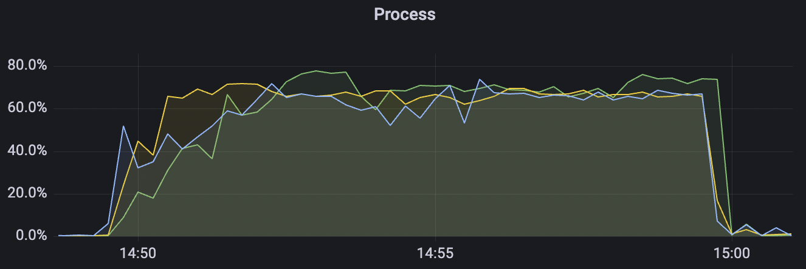 |  |

### Million Connections Scenarios

This scenario is designed to test BifroMQ's resource consumption when handling a large number of connections.

| Scenario combinations                | cleanSession | Connection number | Connection establishment rate | cpu  | Memory(GB) |
| ----------------------- | ------------ | ------ | ------------ | ---- | ---------- |
| conn-tcp-1M-5K_1n_true  | true         | 1M     | 5k           | 30% | 13G    |
| conn-tcp-1M-5K_1n_false | false        | 1M     | 5k           | 55%  | 18G        |

conn-tcp-1M-5K_1n_true scenario charts：

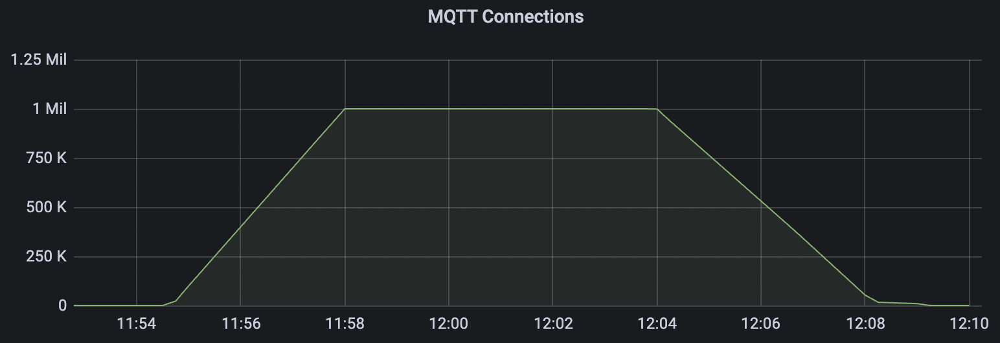

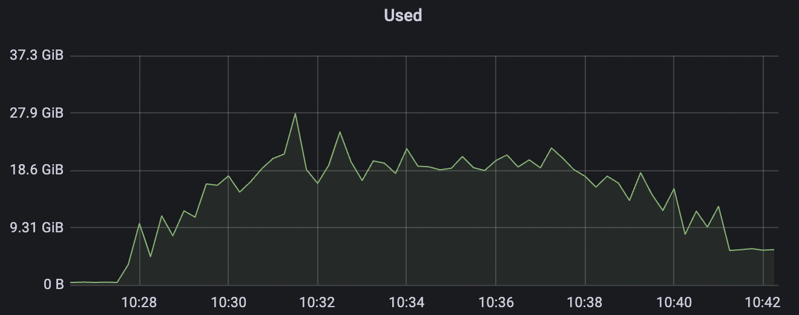

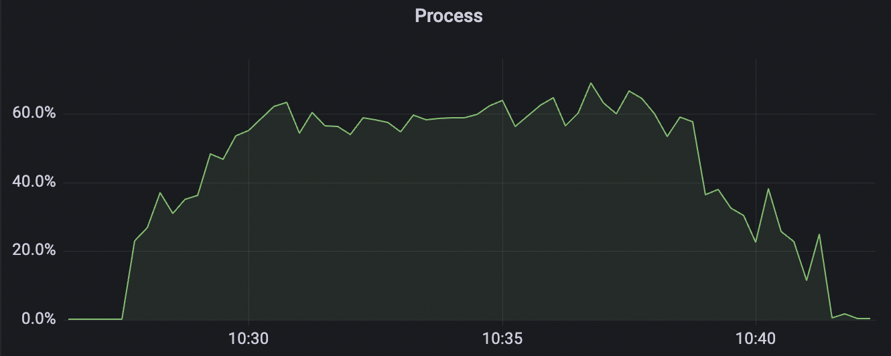

conn-tcp-1M-5K_1n_false scenario charts：


## System Parameter Optimization

The following Kernel parameters can affect the maximum number of connections that the machine hosting BifroMQ can
accept.

### Memory

* vm.max_map_count: Limits the number of VMAs (Virtual Memory Areas) that a process can have. It can be increased to
  221184.

### Maximum Open Files

* nofile: Specifies the maximum number of files that a single process can open.
* nr_open: Specifies the maximum number of files that can be allocated per process, usually defaulting to 1024 * 1024 =
  1048576.
* file-max: Specifies the maximum number of files that the system kernel can open, with a default value of 185745.

### NetFilter Tuning

Use `sysctl -a | grep conntrack` to view the current parameters. The following parameters determine the maximum number
of connections:

* net.netfilter.nf_conntrack_buckets: The size of the hashtable buckets that record connection entries.
    * Modification command: `echo 262144 > /sys/module/nf_conntrack/parameters/hashsize`
* net.netfilter.nf_conntrack_max: The maximum number of entries in the hashtable, generally equal to
  nf_conntrack_buckets * 4.
* net.nf_conntrack_max: Same as net.netfilter.nf_conntrack_max.
* net.netfilter.nf_conntrack_tcp_timeout_fin_wait: Default 120s -> Recommended 30s.
* net.netfilter.nf_conntrack_tcp_timeout_time_wait: Default 120s -> Recommended 30s.
* net.netfilter.nf_conntrack_tcp_timeout_close_wait: Default 60s -> Recommended 15s.
* net.netfilter.nf_conntrack_tcp_timeout_established: Default 432000 seconds (5 days) -> Recommended 300s.

The following sysctl parameters can affect the performance of TCP channels under high load:

### Server-Side and Load Testing TCP-related Tuning

It is recommended to use the CentOS 7 environment for deployment and stress testing.

For CentOS 6, system parameter tuning is required:

* net.core.wmem_max: Maximum TCP data send window size (bytes).
    * Modification command: `echo 'net.core.wmem_max=16777216' >> /etc/sysctl.conf`
* net.core.wmem_default: Default TCP data send window size (bytes).
    * Modification command: `echo 'net.core.wmem_default=262144' >> /etc/sysctl.conf`
* net.core.rmem_max: Maximum TCP data receive window size (bytes).
    * Modification command: `echo 'net.core.rmem_max=16777216' >> /etc/sysctl.conf`
* net.core.rmem_default: Default TCP data receive window size (bytes).
    * Modification command: `echo 'net.core.rmem_default=262144' >> /etc/sysctl.conf`
* net.ipv4.tcp_rmem: Memory usage of the socket receive buffer - minimum, warning, maximum.
    * Modification command: `echo 'net.ipv4.tcp_rmem= 1024 4096 16777216' >> /etc/sysctl.conf`
* net.ipv4.tcp_wmem: Memory usage of the socket send buffer - minimum, warning, maximum.
    * Modification command: `echo 'net.ipv4.tcp_wmem= 1024 4096 16777216' >> /etc/sysctl.conf`
* net.core.optmem_max: The maximum buffer size (in bytes) allowed for each socket.
    * Modification command: `echo 'net.core.optmem_max = 16777216' >> /etc/sysctl.conf`
* net.core.netdev_max_backlog: The length of the queue into which network device places requests.
    * Modification command:`echo 'net.core.netdev_max_backlog = 16384' >> /etc/sysctl.conf`

After making the modifications, use `sysctl -p` and restart the server for them to take effect.
