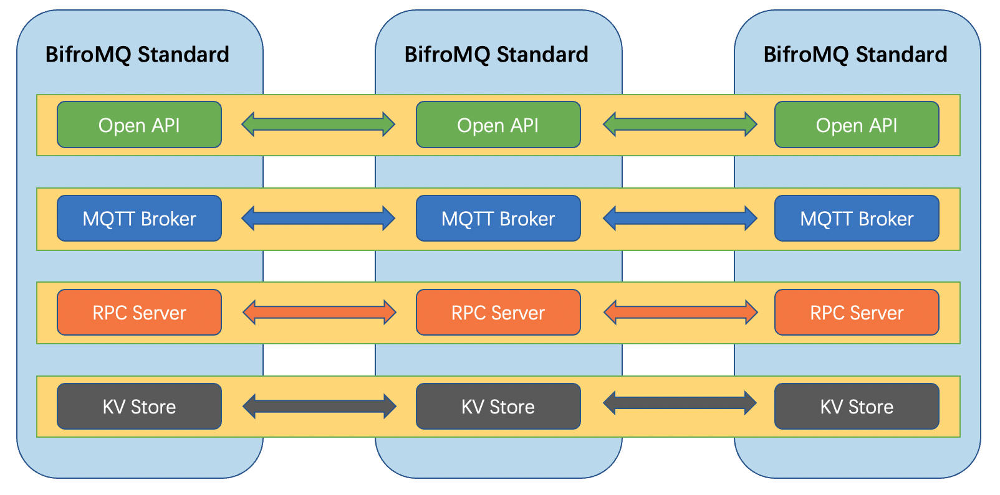
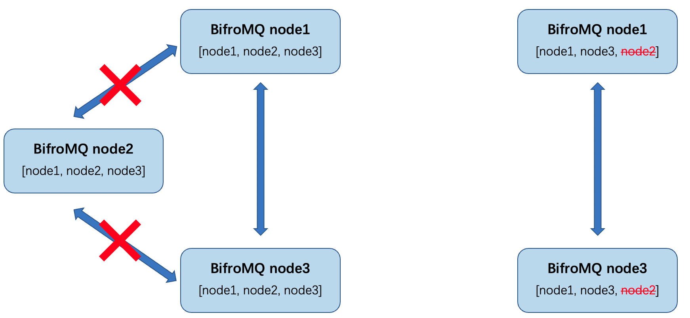
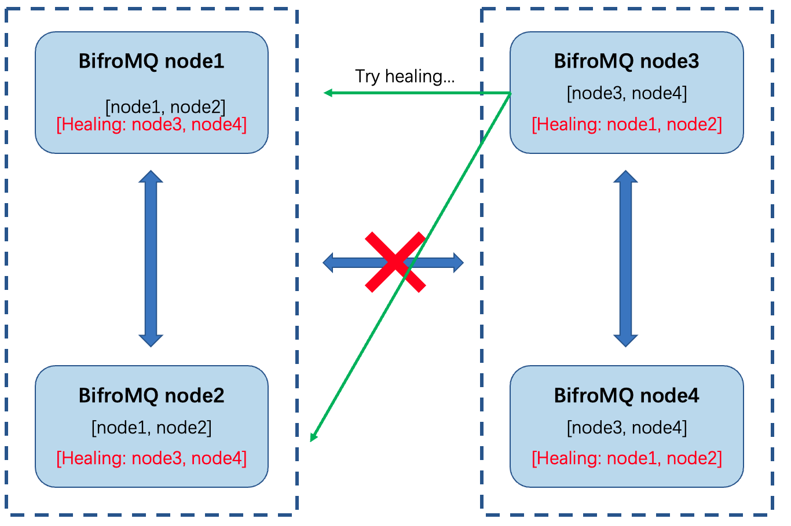
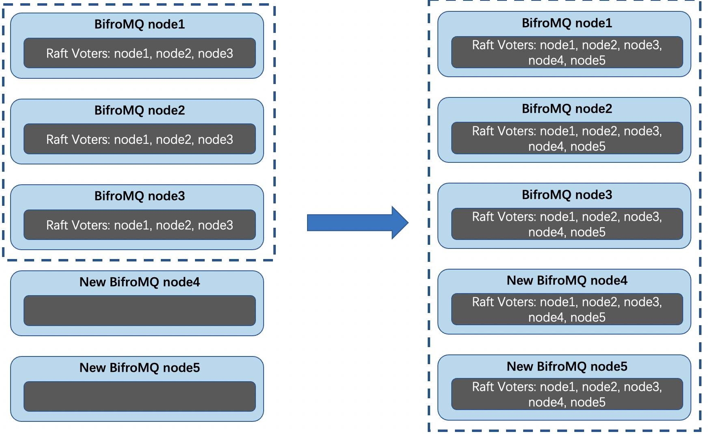

# BifroMQ 高可用技术介绍

## 引言

BifroMQ 的集群版本目前已推出至社区，一般来说，用户对于集群部署最基本的两个诉求是处理能力的水平扩展，以及保证集群整体的高可用性。BifroMQ对于性能水平扩展的介绍已在**《BifroMQ StandardCluster》**进行介绍，本文将着重介绍BifroMQ 在高可用方面的技术实现。

## 去中心化集群

出于功能解耦及精细化的进行负载管理出发点，BifroMQ 内部各功能模块具有独立性，各功能点在集群部署的模式下分别组成逻辑上的功能子集群。各个功能服务集群均构建在一套去中心化的底层集群构建能力（base-cluster）之上，详细设计见：**《BifroMQ 技术架构概览》**。

### 基于base-cluster的高可用

base-cluster是一套基于Gossip 类的协议（SWIM Protocol）的集群构建技术框架，天然的具有自动扩展、去中心化的特性，不依赖传统意义上的注册中心或名字服务，消除了单点故障的运维风险，保证集群的高可用性。

根据实现来划分，BifroMQ内部的功能子集群可分为：

* Open API
* MQTT接入服务
* 内部RPC服务
* KV存储服务
* CRDT分布式数据结构

**设计优势：**

1. 基于base-cluster构建的BifroMQ功能子集群天然继承了其在高可用方面的特性。
2. 随着BifroMQ的集群化部署，每个功能子集群自动形成了高可用集群，无需额外运维。

### 高可用表现

#### 自动发现

新增的 BifroMQ 节点可以通过向集群中的任意节点发送 Join 请求，或者加入 BifroMQ 集群所属的网络 Domain，就会被加入集群，并从集群自动同步获取到当前的拓扑。

同样，新增节点中的各子服务会自动加入到 BifroMQ 集群的对应子服务集群中。

#### 自动驱逐

正常退出的 BifroMQ 节点会主动清理自身注册的服务身份，并同步至集群的其他节点。

集群中的每个节点都在不断地对其他节点进行探活（SWIM Protocol）。当有节点宕机时，其他节点会探测到，并将其相关信息从各功能集群中移除，以防止其对集群功能的可用性造成影响。

与自动驱逐机制配合的还有自愈机制，防止有健康的节点因为抖动或者探活误判导致注册信息被其余节点抹除。每个节点都会在观测到集群拓扑变动时，再次检查自身注册的信息，如有缺失会进行补充，最终使集群整体信息达到完整一致。

#### 脑裂恢复

对于去中心化的集群服务来说，由于一些网络故障、入网络分区等容易导致集群脑裂，分为两个或多个互相隔离的集群。

`base-cluster`对于可能出现的脑裂故障做了保障，进一步提高了集群部署的高可用性。具体过程如下：

* 宕机被移除的节点同时会被其余节点加入至"愈合列表"，会被定时的再次探活，直到超出设定的 MTTR。在集群发生脑裂后，每个集群都会不断地探活其余集群的节点。网络故障恢复后，会迅速地恢复为一个完整的集群。

## Raft算法

去中心化集群为 BifroMQ 中的无状态功能子集群的高可用提供了保障，然而对于 BifroMQ 中基于分布式存储构建的功能子集群来说，高可用有更高的要求。

BifroMQ 中存储相关的 `base-kv` 模块在 `base-cluster` 的基础上，采用 Raft 算法来保证一致性及高可用。在 Raft 算法中，为了保持一致性，至少需要半数以上的节点正常运行。因此，Raft 能够容忍少于半数的节点不可用，这也意味着存储子集群的高可用性也遵循这一规则。

### 自适应Raft Config

在 Raft 算法中，集群的可用性取决于当前 Raft Config 中列表成员的可用性表现。在 BifroMQ 中，Raft 集群副本数可以随着部署节点的数量动态地进行调整，以最大限度地提供当前规模下的集群最优的可用性。

举例说明如下：

* 集群扩容：当存在三个 Raft 节点时，Raft Voter 数为 3，集群最多能够容忍一个节点不可用。在 BifroMQ 中，当新增两个 Raft 节点后，Raft Config 会将新增的节点纳入 Voter 列表并同步数据副本，Raft Voter 数变为 5，集群能够容忍两个节点不可用，整体可用性得到了提升。
* 集群缩容：当存在 5 个 Raft 节点时，Raft Voter 数为 5。之后有两个节点宕机，根据 Raft 算法此刻集群仍然能够正确工作。如果 Raft Config 保持不变，则再有一台节点宕机后 Raft 集群将不可工作。在 BifroMQ 中，Raft Config 会将 Voter 列表调整为仅包含当前 3 个可用的节点，此时集群仍然可以容忍一个节点不可用，保持了高可用性。

### 分布式存储

BifroMQ 内部的存储能力包括 MQTT 订阅路由、离线消息队列、Retain 消息三部分，对应模块名称分别为：`dist-worker`、`inbox-store`、`retain-store`。这三部分存储分别组成独立的 Raft 子集群。根据存储内容使用场景的不同，每个 Raft 集群可以分别设置不同的 Raft Config 自适应策略，同时也会表现出不同的高可用能力。

#### dist-worker

MQTT 路由维护了订阅者及 Topic Filter 的信息，同时在接收到 Publish 消息时进行查找及匹配。属于典型的读多写少的场景，且对订阅动作本身的响应时延要求较低，对查找路由的响应时间要求较高。

结合上述使用场景与 Raft 算法的特点，`dist-worker` 中的默认 Raft Config 自适应策略为集群副本数与集群节点数保持一致，尽可能增加其副本数以保证查询吞吐。副本中最多包含 3 个 Voter，其余身份为 Learner，这样可以在一定程度上保证了此部分能力的高可用性。Raft Config 自适应策略可通过启动时附带环境变量进行调整。

#### retain-store

Retain 消息的存储与路由类似，也是读多写少的场景。因此，其默认 Raft Config 自适应策略与 `dist-worker` 相同，不再赘述。

#### inbox-store

BifroMQ 会为每个 `cleanSession=false` 的连接创建一个持久化的离线消息队列。归属此连接的 Publish 消息均会先写入此队列。当连接在线时，再从队列中取出消息推送并删除。此使用场景以写和线性读为主，对 Raft Leader 写入性能要求较高，存储动作的响应时延对系统整体消息吞吐影响较大。

结合上述使用场景与 Raft 算法的特点，副本数越多则可用性更高，但是写入响应时延会更大。`inbox-store` 中的默认 Raft Config 自适应策略为集群副本数为 1，默认情况下首先保障消息吞吐。可通过启动时附带环境变量调整策略，使其副本数可以动态扩展，从而增强此部分能力的高可用性。

## 未来展望

在 BifroMQ 中，我们将 MQTT 协议的工作负载进行了拆分，使得每种负载都能以独立子集群的形式存在。这些子集群通过协作构建了完整的 MQTT 能力。目前，BifroMQ Standard 采用了所有负载 all in one 的模式，因此需要满足各子集群的最低高可用要求，主要是 Raft 算法对于可用性的要求。

从实现的角度来看，BifroMQ 提供了将每种功能拆分为独立部署的子集群的能力。例如，独立的 RPC 服务集群、独立的 KV 存储集群、独立的 MQTT 接入集群等。各负载集群可根据实际需求选择不同的部署规格及高可用策略，进一步提高 BifroMQ 集群整体的高可用性和灵活性。

