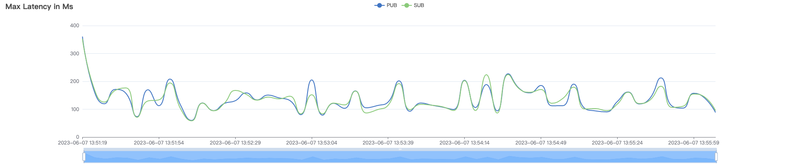
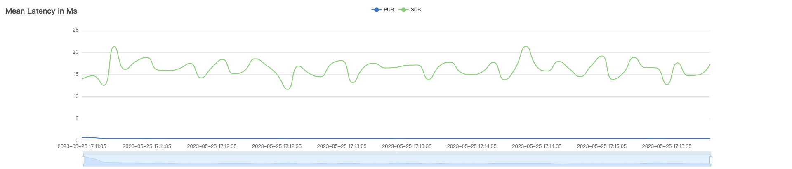
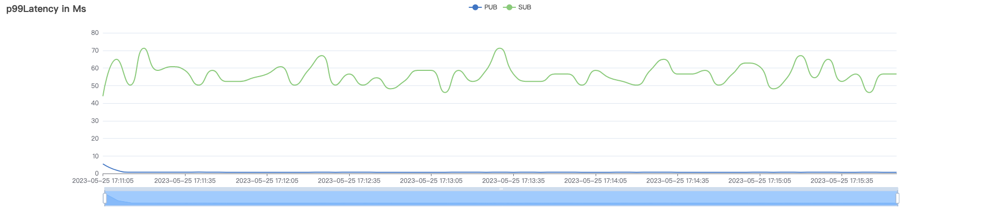
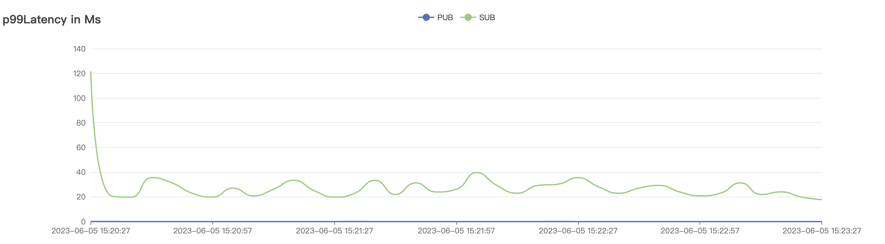
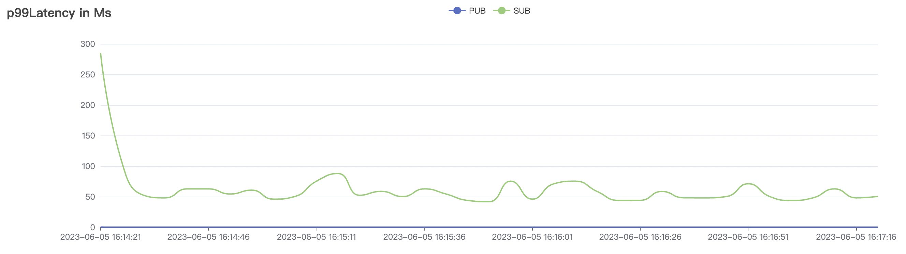
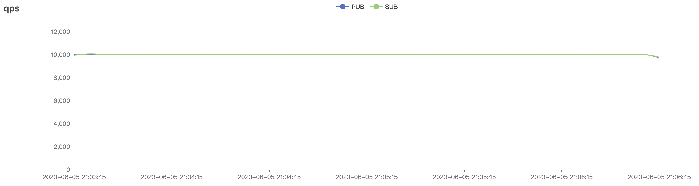
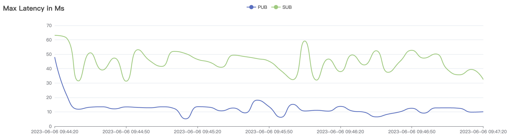
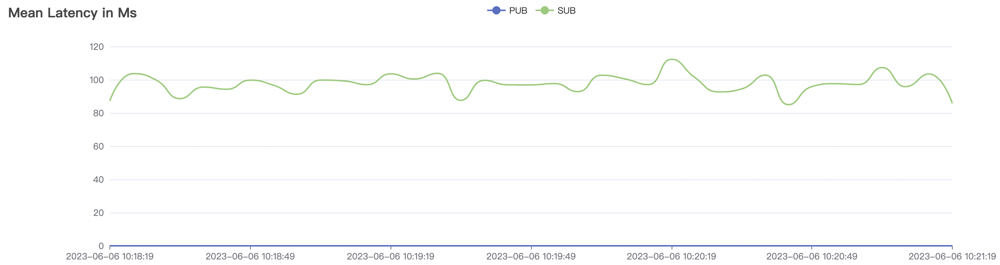
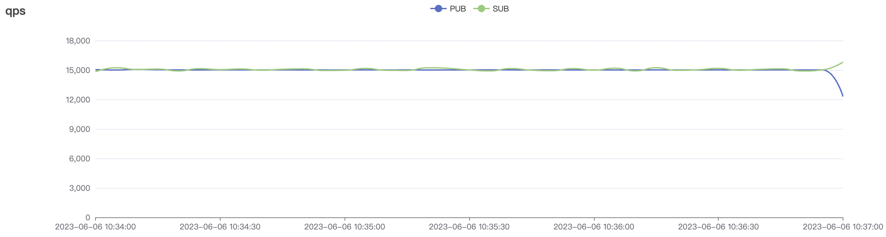

# 测试报告

## 测试目的

测试BifroMQ单机版在不同消息吞吐模式下，响应时间及资源消耗等性能指标。

## 测试工具、测试环境

### 测试工具

基于vertx-mqtt开发的测试工具，具有较灵活的使用方式及优良的性能表现。

### 测试环境

BifroMQ部署机：CentOS release 7.6， 32核， 128G内存（实际配置JVM内存40G）
发压机：CentOS release 7.6， 32核， 128G内存（实际配置JVM内存32G）

## 测试场景

本测试报告主要针对消息吞吐测试。  
测试维度分为：  

* Pub & Sub比例：1对1、1对多
* cleanSession配置：true | false
* QoS：0 | 1 | 2
* payload大小：32b | 1024b
* 单连接消息频率：1 ~ 100不等
* 共享订阅

每个场景的测试由以上维度组合而来。

## 测试报告

### 参数说明

场景名称由测试用例中各维度参数组合而来，如100_100_qos0_p1024_50mps表示：

* 100个Pub MQTT client
* 100个Sub MQTT client
* 消息及订阅质量使用QoS0
* 单个消息payload大小1024 bytes
* 单个Pub client每秒发送50条message至BifroMQ

| 参数 | 说明                      |
| ---- | ------------------------- |
| C    | 测试用例总MQTT连接数      |
| m/s  | 每秒发送至BifroMQ的消息数 |
| ms   | 响应时间，单位毫秒        |

### 结果说明

1. cleanSession=true高频场景消息吞吐最高可达20W/s以上，低频场景消息吞吐最高可达10W/s以上。
2. cleanSession=false高频场景消息吞吐最高可达1.5W/s以上，低频场景消息吞吐最高可达1W/s以上。
3. 消息从Pub端至Sub端的响应时间均为毫秒级，CPU负载均处于低位。
4. 系统吞吐及时延性能受QoS质量影响较大，其中QoS0与QoS1场景差距不明显，QoS2场景受影响较为明显，原因为协议本身复杂度导致。
5. 在一些测试场景附图中的首个采样点的latency数据偏大，是测试用例未经预热直接冷启动引起的压力负荷突变导致，平稳运行中的服务不会出现此情况。
6. cleanSession=false与cleanSession=true场景的性能结果存在数倍的差距。原因是BifroMQ的架构是为构建serverless云服务而设计的，离线消息的可靠性是云服务SLA的重要指标，因此BifroMQ选择了基于磁盘而非内存的持久化策略，在宕机或重启时不会丢失数据。单机（Standalone）版本的离线消息存储性能受到当前测试机器本地磁盘 IO 性能的限制，采用高性能磁盘替换，或在集群环境下搭配合适的负载策略，都可以有效提升性能。

### cleanSession=true高频场景

#### QoS0场景
| 场景组合                     | QoS | 单连接m/s | Payload(byte) | 连接数C | 总消息m/s | 平均响应时间ms | P99响应时间ms | CPU |
|--------------------------|-----|--------|---------------|------|--------|----------|-----------|-----|
| 100_100_qos0_p1024_50mps | 0   | 50     | 1024          | 200  | 5k     | 0.31     | 0.43      | 2.5% |
| 1k_1k_qos0_p1024_50mps   | 0   | 50     | 1024          | 2k   | 50k    | 0.42     | 1.30      | 21% |
| 2k_2k_qos0_p32_100mps    | 0   | 100    | 32            | 4k   | 200k   | 2.38   | 15.72    | 40% |
| 4k_4k_qos0_p32_50mps     | 0   | 50     | 32            | 8k   | 200k   | 6.65    | 48.23    | 31% |
| 5k_5k_qos0_p32_50mps     | 0   | 50     | 32            | 10k  | 226k   | 12.51    | 56.61    | 30% |

4k_4k_qos0_p32_50mps场景附图：

#### QoS1场景
| 场景组合                     | QoS | 单连接m/s | Payload(byte) | 连接数C | 总消息m/s | 平均响应时间ms | P99响应时间ms | CPU |
|--------------------------|-----|--------|---------------|------|--------|----------|-----------|-----|
| 100_100_qos1_p1024_50mps | 1   | 50     | 1024          | 200  | 5k     | 0.27     | 0.42      | 2.6% |
| 1k_1k_qos1_p1024_50mps   | 1   | 50     | 1024          | 2k   | 50k    | 0.49     | 1.89      | 23% |
| 2k_2k_qos1_p32_100mps    | 1   | 100    | 32            | 4k   | 182k   | 20.89   | 218.1    | 38% |
| 4k_4k_qos1_p32_50mps     | 1   | 50     | 32            | 8k   | 179k   | 31.35    | 352.31    | 26% |
| 5k_5k_qos1_p32_50mps     | 1   | 50     | 32            | 10k  | 189k   | 54.43    | 419.42    | 36% |

2k_2k_qos1_p32_50mps场景附图：

#### QoS2场景

| 场景组合                     | QoS | 单连接m/s | Payload(byte) | 连接数C | 总消息m/s | 平均响应时间ms | P99响应时间ms | CPU |
|--------------------------|-----|--------|---------------|------|--------|----------|-----------|-----|
| 1.2k_1.2k_qos2_p32_50mps   | 2   | 100     | 32          | 2.4k   | 120k    | 7.08     | 41.93      | 40% |
| 2k_2k_qos2_p32_100mps    | 2   | 100    | 32            | 4k   | 138k   | 38.02   | 201.31    | 40% |

1.2k_1.2k_qos2_p32_50mps场景附图：

### cleanSession=true低频场景

#### QoS0场景
| 场景组合                      | QoS | 单连接m/s | Payload(byte) | 连接数C | 总消息m/s | 平均响应时间ms | P99响应时间ms | CPU |
|---------------------------|-----|--------|---------------|------|--------|------|-------|-----|
| 50k_50k_qos0_p1024_1mps   | 0   | 1      | 1024          | 100k | 50k    | 0.85 | 4.16  | 23% |
| 100k_100k_qos0_p1024_1mps | 0   | 1      | 1024          | 200k | 100k   | 13.54     | 209.68      | 40%  |

100k_100k_qos0_p1024_1mps场景附图：

#### QoS1场景
| 场景组合                      | QoS | 单连接m/s | Payload(byte) | 连接数C | 总消息m/s | 平均响应时间ms | P99响应时间ms | CPU |
|---------------------------|-----|--------|---------------|------|--------|----------|-----|-----|
| 50k_50k_qos1_p1024_1mps   | 1   | 1      | 1024          | 100k | 50k    | 5.55     | 14.12 | 32% |
| 100k_100k_qos1_p1024_1mps | 1   | 1      | 1024          | 200k | 100k   | 27.36    | 603.95    | 30% |

100k_100k_qos1_p1024_1mps场景附图：

#### QoS2场景
| 场景组合                      | QoS | 单连接m/s | Payload(byte) | 连接数C | 总消息m/s | 平均响应时间ms | P99响应时间ms | CPU |
|---------------------------|-----|--------|---------------|------|--------|----------|-----------|-----|
| 50k_50k_qos2_p1024_1mps   | 2   | 1      | 1024          | 100k | 50k    | 25.32    | 184.48    | 25% |

50k_50k_qos2_p1024_1mps场景附图：

### cleanSession=true共享订阅场景

| 场景组合                    | QoS | 单连接m/s | Payload(byte) | 连接数C   | 总消息m/s | 平均响应时间ms | P99响应时间ms | CPU |
|-------------------------|-----|--------|---------------|--------|--------|----------|-----------|-----|
| 40k_400_qos0_p1024_1mps | 0   | 1      | 1024          | 400.4k | 40k    | 0.32     | 3.40      | 18% |
| 40k_400_qos1_p1024_1mps | 1   | 1      | 1024          | 400.4k | 40k    | 0.61     | 6.81      | 19% |
| 40k_400_qos2_p1024_1mps | 2   | 1      | 1024          | 400.4k | 40k    | 0.81   | 7.06    | 23% |

40k_400_qos2_p1024_1mps场景附图：

### cleanSession=false共享订阅场景

| 场景组合                  | QoS | 单连接m/s | Payload(byte) | 连接数C   | 总消息m/s | 平均响应时间ms | P99响应时间ms | CPU |
|-----------------------|-----|--------|---------------|--------|--------|----------|-------|-----|
| 5k_50_qos0_p1024_1mps | 0   | 1      | 1024          | 5050   | 5k     | 7.22     | 30.38 | 7%  |
| 5k_50_qos1_p1024_1mps | 1   | 1      | 1024          | 5050 | 5k     | 6.79     | 27.23 | 7%  |
| 5k_50_qos2_p1024_1mps | 2   | 1      | 1024          | 5050 | 5k     | 16.24     | 56.56      | 7%  |

5k_50_qos2_p1024_1mps场景附图：

### cleanSession=true fanOut场景

少量客户端作为Publisher，大量客户端订阅相同的topic作为Subscriber，形成每条消息被大规模fanOut广播的场景。

| 场景组合              | QoS  | 单连接m/s | Payload(byte) | Pub连接数C | Sub连接数 | Pub消息m/s | Sub消息m/s | 平均响应时间ms | P99响应时间ms | CPU  |
| --------------------- | ---- | --------- | ------------- | ---------- | --------- | ---------- | ---------- | -------------- | ------------- | ---- |
| 1_1k_qos1_p32_1mps    | 1    | 1         | 32            | 1          | 1k        | 1          | 1k         | 6              | 18            | 4%   |

1_1k_qos1_p32_1mps场景附图：

### cleanSession=false 1对1 低频场景

#### QoS0场景

| 场景组合                | QoS  | 单连接m/s | Payload(byte) | 连接数C | 总消息m/s | 平均响应时间ms | P99响应时间ms | CPU  |
| ----------------------- | ---- | --------- | ------------- | ------- | --------- | -------------- | ------------- | ---- |
| 1k_1k_qos0_p32_1mps     | 0    | 1         | 32            | 2k      | 1k        | 1.3            | 2.2           | 6%   |
| 1k_1k_qos0_p1024_1mps   | 0    | 1         | 1024          | 2k      | 1k        | 1.4            | 2.3           | 6%   |
| 5k_5k_qos0_p32_1mps     | 0    | 1         | 32            | 10k     | 5k        | 2.7            | 5.2           | 18%  |
| 5k_5k_qos0_p1024_1mps   | 0    | 1         | 1024          | 10k     | 5k        | 3.0            | 6.5           | 18%  |
| 10k_10k_qos0_p32_1mps   | 0    | 1         | 32            | 20k     | 10k       | 9.6            | 29            | 26%  |
| 10k_10k_qos0_p1024_1mps | 0    | 1         | 1024          | 20k     | 10k       | 21             | 63            | 26%  |

10k_10k_qos0_p32_1mps场景附图：

10k_10k_qos0_p1024_1mps场景附图：

#### QoS1场景

| 场景组合                | QoS  | 单连接m/s | Payload(byte) | 连接数C | 总消息m/s | 平均响应时间ms | P99响应时间ms | 常驻内存 | CPU  |
| ----------------------- | ---- | --------- | ------------- | ------- | --------- | -------------- | ------------- | -------- | ---- |
| 1k_1k_qos1_p32_1mps     | 1    | 1         | 32            | 2k      | 1k        | 1.4            | 2.3           |          | 8%   |
| 1k_1k_qos1_p1024_1mps   | 1    | 1         | 1024          | 2k      | 1k        | 1.4            | 2.3           |          | 8%   |
| 5k_5k_qos1_p32_1mps     | 1    | 1         | 32            | 10k     | 5k        | 3.2            | 7.0           |          | 20%  |
| 5k_5k_qos1_p1024_1mps   | 1    | 1         | 1024          | 10k     | 5k        | 3.1            | 7.6           |          | 20%  |
| 10k_10k_qos1_p32_1mps   | 1    | 1         | 32            | 20k     | 10k       | 13             | 30            |          | 30%  |
| 10k_10k_qos1_p1024_1mps | 1    | 1         | 1024          | 20k     | 10k       | 49             | 117           |          | 30%  |

10k_10k_qos1_p32_1mps场景附图：

10k_10k_qos1_p1024_1mps场景附图：

#### QoS2场景

| 场景组合              | QoS  | 单连接m/s | Payload(byte) | 连接数C | 总消息m/s | 平均响应时间ms | P99响应时间ms | CPU  |
| --------------------- | ---- | --------- | ------------- | ------- | --------- | -------------- | ------------- | ---- |
| 1k_1k_qos2_p32_1mps   | 2    | 1         | 32            | 2k      | 1k        | 1.6            | 2.8           | 8%   |
| 1k_1k_qos2_p1024_1mps | 2    | 1         | 1024          | 2k      | 1k        | 1.7            | 3.0           | 8%   |
| 5k_5k_qos2_p32_1mps   | 2    | 1         | 32            | 10k     | 5k        | 3.8            | 8.3           | 22%  |
| 5k_5k_qos2_p1024_1mps | 2    | 1         | 1024          | 10k     | 5k        | 8.2            | 40            | 22%  |
| 7k_7k_qos2_p32_1mps   | 2    | 1         | 32            | 14k     | 7k        | 9.6            | 28            | 24%  |
| 7k_7k_qos2_p1024_1mps | 2    | 1         | 1024          | 14k     | 7k        | 15             | 50            | 24%  |

7k_7k_qos2_p32_1mps场景附图：

7k_7k_qos2_p1024_1mps场景附图：

### cleanSession=false 1对1 高频场景

#### QoS0场景

| 场景组合                 | QoS  | 单连接m/s | Payload(byte) | 连接数C | 总消息m/s | 平均响应时间ms | P99响应时间ms | 常驻内存 | CPU  |
| ------------------------ | ---- | --------- | ------------- | ------- | --------- | -------------- | ------------- | -------- | ---- |
| 20_20_qos0_p32_50mps     | 0    | 50        | 32            | 40      | 1k        | 11             | 96            |          | 8%   |
| 20_20_qos0_p1024_50mps   | 0    | 50        | 1024          | 40      | 1k        | 21             | 117           |          | 8%   |
| 100_100_qos0_p32_50mps   | 0    | 50        | 32            | 200     | 5k        | 23             | 84            |          | 14%  |
| 100_100_qos0_p1024_50mps | 0    | 50        | 1024          | 200     | 5k        | 28             | 92            |          | 14%  |
| 200_200_qos0_p32_50mps   | 0    | 50        | 32            | 400     | 10k       | 47             | 113           |          | 18%  |
| 200_200_qos0_p1024_50mps | 0    | 50        | 1024          | 400     | 10k       | 58             | 130           |          | 18%  |
| 300_300_qos0_p32_50mps   | 0    | 50        | 32            | 600     | 15k       | 67             | 142           |          | 22%  |
| 300_300_qos0_p1024_50mps | 0    | 50        | 1024          | 600     | 15k       | 90             | 184           |          | 22%  |

300_300_qos0_p32_50mps场景附图：

300_300_qos0_p1024_50mps场景附图：

#### QoS1场景

| 场景组合                 | QoS  | 单连接m/s | Payload(byte) | 连接数C | 总消息m/s | 平均响应时间ms | P99响应时间ms | 常驻内存 | CPU  |
| ------------------------ | ---- | --------- | ------------- | ------- | --------- | -------------- | ------------- | -------- | ---- |
| 20_20_qos1_p32_50mps     | 1    | 50        | 32            | 40      | 1k        | 4.6            | 38            |          | 10%  |
| 20_20_qos1_p1024_50mps   | 1    | 50        | 1024          | 40      | 1k        | 20             | 117           |          | 10%  |
| 100_100_qos1_p32_50mps   | 1    | 50        | 32            | 200     | 5k        | 26             | 92            |          | 20%  |
| 100_100_qos1_p1024_50mps | 1    | 50        | 1024          | 200     | 5k        | 32             | 101           |          | 20%  |
| 200_200_qos1_p32_50mps   | 1    | 50        | 32            | 400     | 10k       | 58             | 151           |          | 23%  |
| 200_200_qos1_p1024_50mps | 1    | 50        | 1024          | 400     | 10k       | 72             | 210           |          | 23%  |
| 300_300_qos1_p32_50mps   | 1    | 50        | 32            | 600     | 15k       | 81             | 210           |          | 28%  |
| 300_300_qos1_p1024_50mps | 1    | 50        | 1024          | 600     | 15k       | 107            | 260           |          | 28%  |

300_300_qos1_p32_50mps场景附图：

300_300_qos1_p1024_50mps场景附图：

#### QoS2 场景

| 场景组合                 | QoS  | 单连接m/s | Payload(byte) | 连接数C | 总消息m/s | 平均响应时间ms | P99响应时间ms | 常驻内存 | CPU  |
| ------------------------ | ---- | --------- | ------------- | ------- | --------- | -------------- | ------------- | -------- | ---- |
| 20_20_qos2_p32_50mps     | 0    | 50        | 32            | 40      | 1k        | 16             | 75            |          | 10%  |
| 20_20_qos2_p1024_50mps   | 0    | 50        | 1024          | 40      | 1k        | 19             | 92            |          | 10%  |
| 100_100_qos2_p32_50mps   | 0    | 50        | 32            | 200     | 5k        | 37             | 92            |          | 15%  |
| 100_100_qos2_p1024_50mps | 0    | 50        | 1024          | 200     | 5k        | 44             | 109           |          | 15%  |

100_100_qos2_p32_50mps场景附图：

100_100_qos2_p1024_50mps场景附图：

## 系统参数优化

以下Kernel参数会影响BifroMQ所在机器能接受的最大连接数

### 内存

* vm.max_map_count: 限制一个进程可以拥有的VMA(虚拟内存区域)的数量, 可放大到221184

### 最大打开文件数

* nofile: 指单进程的最大打开文件数
* nr_open: 指单个进程可分配的最大文件数，通常默认值为1024*1024=1048576
* file-max: 系统内核一共可以打开的最大值，默认值是185745

### NetFilter调优

通过`sysctl -a | grep conntrack`查看当前的参数，以下几个参数决定了最大连接数:

* net.netfilter.nf_conntrack_buckets: 记录连接条目的hashtable的bucket大小
    * 修改命令：`echo 262144 > /sys/module/nf_conntrack/parameters/hashsize`
* net.netfilter.nf_conntrack_max: hashtable最大的条目数，一般为nf_conntrack_buckets * 4
* net.nf_conntrack_max: 同net.netfilter.nf_conntrack_max
* net.netfilter.nf_conntrack_tcp_timeout_fin_wait: 默认 120s -> 30s
* net.netfilter.nf_conntrack_tcp_timeout_time_wait: 默认 120s -> 30s
* net.netfilter.nf_conntrack_tcp_timeout_close_wait: 默认 60s -> 15s
* net.netfilter.nf_conntrack_tcp_timeout_established: 默认 432000 秒（5天）-> 300s

以下sysctl参数会影响大压力下tcp channel性能表现

### Server端及测试发压端TCP相关调优

推荐使用centos7环境进行部署及压力测试。

centos6环境需要进行系统参数调优: 
* net.core.wmem_max: 最大的TCP数据发送窗口大小（字节）
  * 修改命令：`echo 'net.core.wmem_max=16777216' >> /etc/sysctl.conf`
* net.core.wmem_default: 默认的TCP数据发送窗口大小（字节）
  * 修改命令：`echo 'net.core.wmem_default=262144' >> /etc/sysctl.conf`
* net.core.rmem_max: 最大的TCP数据接收窗口大小（字节）
  * 修改命令：`echo 'net.core.rmem_max=16777216' >> /etc/sysctl.conf`
* net.core.rmem_default: 默认的TCP数据接收窗口大小（字节）
  * 修改命令：`echo 'net.core.rmem_default=262144' >> /etc/sysctl.conf`
* net.ipv4.tcp_rmem: socket接收缓冲区内存使用的下限  警戒值  上限
  * 修改命令：`echo 'net.ipv4.tcp_rmem= 1024 4096 16777216' >> /etc/sysctl.conf`
* net.ipv4.tcp_rmem: socket发送缓冲区内存使用的下限  警戒值  上限
  * 修改命令：`echo 'net.ipv4.tcp_wmem= 1024 4096 16777216' >> /etc/sysctl.conf`
* net.core.optmem_max: 每个socket所允许的最大缓冲区的大小 (字节)
  * 修改命令：`echo 'net.core.optmem_max = 16777216' >> /etc/sysctl.conf`
* net.core.netdev_max_backlog: 网卡设备将请求放入队列的长度
  * 修改命令：`echo 'net.core.netdev_max_backlog = 16384' >> /etc/sysctl.conf`

修改完配置通过`sysctl -p`并重启服务器生效。
