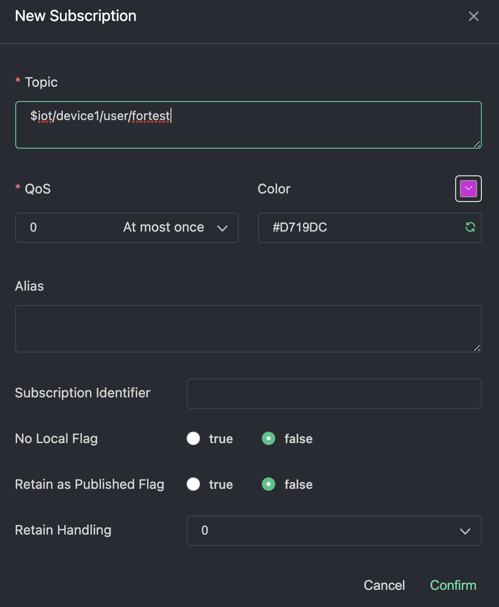

以下是使用客户端工具MQTTX 快速验证 BifroMQ 基本 MQTT 功能的步骤。

1. 访问 https://mqttx.app/ 下载并安装 MQTTX。
2. 打开 MQTTX 并点击左侧边栏的“新建连接”或“+”号以创建新的连接配置。

3. 填写所需字段:
    * Name：此配置的名称。您可以选择任意名称。
    * Client ID：客户端 ID，您可以手动设置或使用右侧的按钮随机生成。它必须包含字符“a-z”、“0-9”、“_”、“-”，并且不能超过 128 字节。使用 UTF8 编码且必须是唯一的。
    * Host: 连接地址。以协议前缀开始（对于 TCP 使用 mqtt://，对于 TLS/SSL 使用 mqtts://，或对于 WSS 使用 wss://），后跟可以访问 BifroMQ 服务器的域名。
    * Port: 连接端口。根据协议前缀选择适当的端口。默认端口是 TCP：1883，TLS/SSL：1884，WSS：443。
    * Username & Password: 输入您拥有的用户名和密码，或者如果您的BifroMQ安装仅用于测试，则留空。
    * MQTT Version: 选择 3.1、3.1.1、5.0

4. 正确输入连接配置后，点击右上角的'连接'以连接到服务器。 
5. 订阅一个主题：点击左上角的“新建订阅”按钮，并在弹出的对话框中输入主题。 

6. 发布消息：在消息发送/接收界面，输入您在右下角订阅的相同主题。选择默认 QoS 0，输入消息内容，并点击发送按钮发布。

7. 消息成功发送后，您应该能在界面的右侧看到发送的消息。