# Test Report

## Test Objectives

To evaluate the performance metrics of BifroMQ Standalone Edition, including response times and resource consumption under different message throughput scenarios.

## Test Tools and Environment

### Test Tools

The test tools were developed based on vertx-mqtt, which provides flexibility in usage and demonstrates excellent performance.

### Test Environment

- BifroMQ Deployment Machine: CentOS release 7.6, 32 cores, 128GB memory (JVM configured with 40GB memory).
- Load Generation Machine: CentOS release 7.6, 32 cores, 128GB memory (JVM configured with 32GB memory).

## Test Scenarios

This test report mainly focuses on message throughput testing. The test dimensions include:

* Publisher & Subscriber Ratio: 1 to 1, 1 to many
* cleanSession Configuration: true | false
* QoS (Quality of Service): 0 | 1 | 2
* Payload Size: 32b | 1024b
* Message Frequency per Connection: Ranging from 1 to 100
* Shared Subscriptions

Each test scenario is comprised of combinations from the dimensions listed above.

## Test Results

The Scenario name is derived from the combination of parameters from the test cases. 

The name "100_100_qos0_p1024_50mps" represents the following: 

* 100 Pub MQTT clients 
* 100 Sub MQTT clients 
* Messages use QoS0 
* Single message payload size is 1024 bytes 
* A single Pub client sends 50 messages per second to BifroMQ

Explanation of Parameters:

| Parameter | Description          |
| --------- | -------------------- |
| C         | Total number of MQTT connections in test cases. |
| m/s       | Number of messages sent to BifroMQ per second. |
| ms        | Message response time from Pub to Sub, measured in milliseconds. |

### Result description

1. When `cleanSession=true`, the highest message throughput in high-frequency scenarios can reach over 200,000 messages per second, and in low-frequency scenarios it can reach over 100,000 messages per second.

2. When `cleanSession=false`, the highest message throughput in high-frequency scenarios can reach over 15,000 messages per second, and in low-frequency scenarios it can reach over 10,000 messages per second.

3. The response time from the publishing end to the subscribing end is in the millisecond range, and the CPU load remains low.

4. The system throughput and latency performance are greatly influenced by the QoS (Quality of Service). The difference between QoS0 and QoS1 scenarios is not significant, while QoS2 scenarios are more affected due to the complexity of the protocol itself.

5. In some test scenarios, the latency data of the first sampling point in the attached images is significantly larger. This is caused by the sudden increase in pressure due to cold-starting the test case without pre-warming. This situation will not occur during smooth operation of the service.

6. There is a significant difference in performance results between `cleanSession=false` and `cleanSession=true` scenarios. This is because the architecture of BifroMQ is designed for building serverless cloud services, and the reliability of offline messages is an important SLA indicator for cloud services. Therefore, BifroMQ chose a disk-based persistence strategy instead of in-memory storage, ensuring that data is not lost during crashes or restarts. The performance of offline message storage in the standalone version is limited by the local disk IO performance of the current testing machine. By using high-performance disks or implementing suitable load balancing strategies in a clustered environment, performance can be effectively improved.

### High-frequency Scenario with cleanSession=true

#### QoS 0 Scenario

| Scenario Combination      | QoS | MPS per Connection | Payload (bytes) | Number of Connections (C) | Total Messages per Second | Average Response Time (ms) | P99 Response Time (ms) | CPU Usage |
|---------------------------|-----|------------------------------------|-----------------|---------------------------|---------------------------|---------------------------|------------------------|-----------|
| 100_100_qos0_p1024_50mps  | 0   | 50                                 | 1024            | 200                       | 5k                        | 0.31                      | 0.43                   | 2.5%      |
| 1k_1k_qos0_p1024_50mps    | 0   | 50                                 | 1024            | 2k                        | 50k                       | 0.42                      | 1.30                   | 21%       |
| 2k_2k_qos0_p32_100mps     | 0   | 100                                | 32              | 4k                        | 200k                      | 2.38                      | 15.72                  | 40%       |
| 4k_4k_qos0_p32_50mps      | 0   | 50                                 | 32              | 8k                        | 200k                      | 6.65                      | 48.23                  | 31%       |
| 5k_5k_qos0_p32_50mps      | 0   | 50                                 | 32              | 10k                       | 226k                      | 12.51                     | 56.61                  | 30%       |

##### Graphs for the 4k_4k_qos0_p32_50mps Scenario:

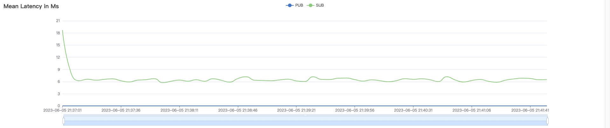
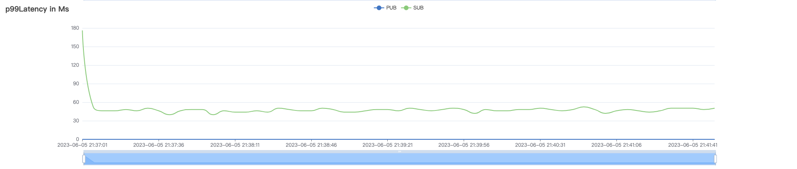
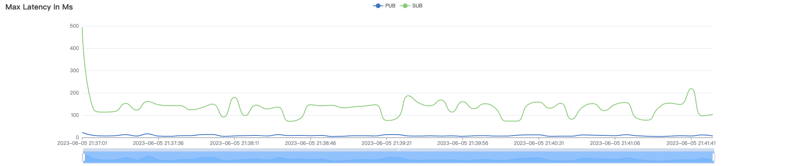

#### QoS 1 Scenario
| Scenario Combination                     | QoS | MPS per Connection | Payload(byte) | Number of Connections (C) | Total Messages per Second | Average Response Time (ms) | P99 Response Time (ms) | CPU |
|--------------------------|-----|--------|---------------|------|--------|----------|-----------|-----|
| 100_100_qos1_p1024_50mps | 1   | 50     | 1024          | 200  | 5k     | 0.27     | 0.42      | 2.6% |
| 1k_1k_qos1_p1024_50mps   | 1   | 50     | 1024          | 2k   | 50k    | 0.49     | 1.89      | 23% |
| 2k_2k_qos1_p32_100mps    | 1   | 100    | 32            | 4k   | 182k   | 20.89   | 218.1    | 38% |
| 4k_4k_qos1_p32_50mps     | 1   | 50     | 32            | 8k   | 179k   | 31.35    | 352.31    | 26% |
| 5k_5k_qos1_p32_50mps     | 1   | 50     | 32            | 10k  | 189k   | 54.43    | 419.42    | 36% |

##### Graphs for the 2k_2k_qos1_p32_50mps Scenario:

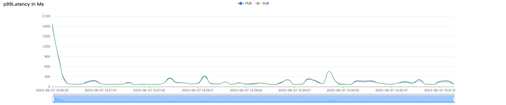

#### QoS 2 Scenario

| Scenario Combination                     | QoS | MPS per Connection | Payload(byte) | Number of Connections (C) | Total Messages per Second | Average Response Time (ms) | P99 Response Time (ms) | CPU |
|--------------------------|-----|--------|---------------|------|--------|----------|-----------|-----|
| 1.2k_1.2k_qos2_p32_50mps   | 2   | 100     | 32          | 2.4k   | 120k    | 7.08     | 41.93      | 40% |
| 2k_2k_qos2_p32_100mps    | 2   | 100    | 32            | 4k   | 138k   | 38.02   | 201.31    | 40% |

##### 2k_1.2k_qos2_p32_50mps Graphs 1for the  Scenario:

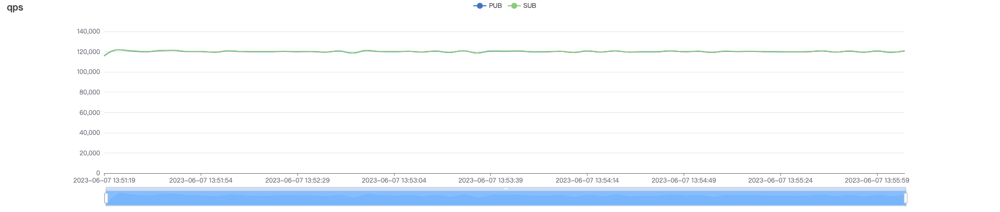

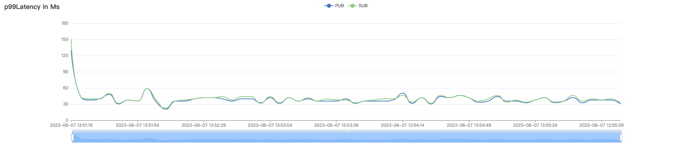

### Low-frequency Scenario with cleanSession=true

#### QoS 0 Scenario
| Scenario Combination                      | QoS | MPS per Connection | Payload(byte) | Number of Connections (C) | Total Messages per Second | Average Response Time (ms) | P99 Response Time (ms) | CPU |
|---------------------------|-----|--------|---------------|------|--------|------|-------|-----|
| 50k_50k_qos0_p1024_1mps   | 0   | 1      | 1024          | 100k | 50k    | 0.85 | 4.16  | 23% |
| 100k_100k_qos0_p1024_1mps | 0   | 1      | 1024          | 200k | 100k   | 13.54     | 209.68      | 40%  |

##### Graphs for the 100k_100k_qos0_p1024_1mps Scenario:

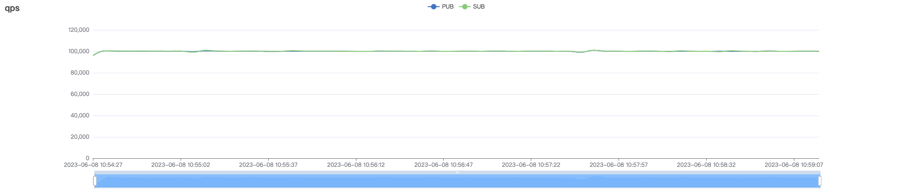

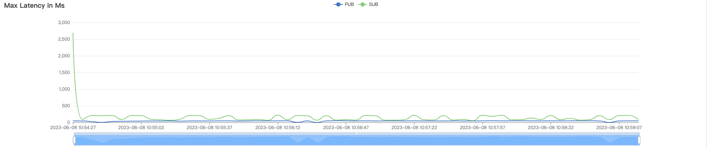

#### QoS 1 Scenario
| Scenario Combination                      | QoS | MPS per Connection | Payload(byte) | Number of Connections (C) | Total Messages per Second | Average Response Time (ms) | P99 Response Time (ms) | CPU |
|---------------------------|-----|--------|---------------|------|--------|----------|-----|-----|
| 50k_50k_qos1_p1024_1mps   | 1   | 1      | 1024          | 100k | 50k    | 5.55     | 14.12 | 32% |
| 100k_100k_qos1_p1024_1mps | 1   | 1      | 1024          | 200k | 100k   | 27.36    | 603.95    | 30% |

##### Graphs for the 100k_100k_qos1_p1024_1mps Scenario:

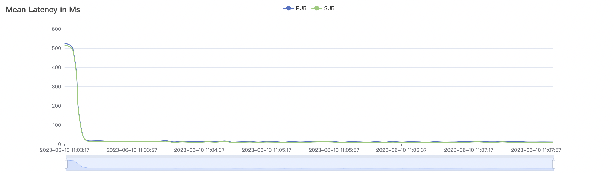

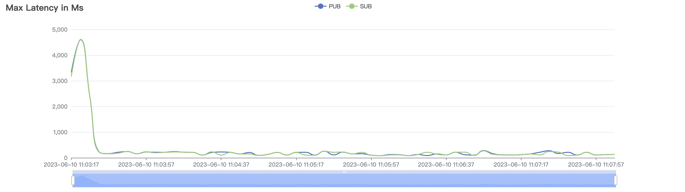

#### QoS 2 Scenario
| Scenario Combination                      | QoS | MPS per Connection | Payload(byte) | Number of Connections (C) | Total Messages per Second | Average Response Time (ms) | P99 Response Time (ms) | CPU |
|---------------------------|-----|--------|---------------|------|--------|----------|-----------|-----|
| 50k_50k_qos2_p1024_1mps   | 2   | 1      | 1024          | 100k | 50k    | 25.32    | 184.48    | 25% |

##### Graphs for the 50k_50k_qos2_p1024_1mps Scenario:

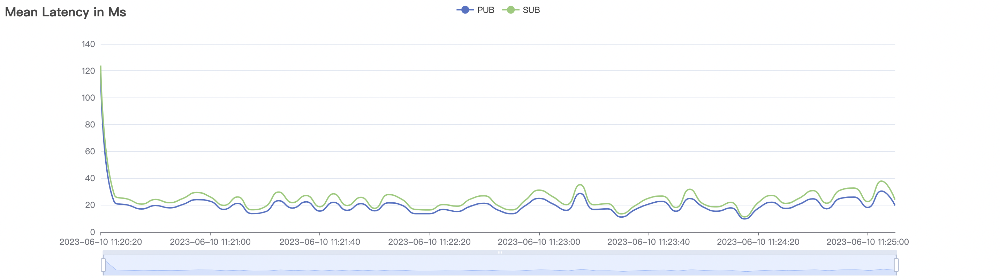
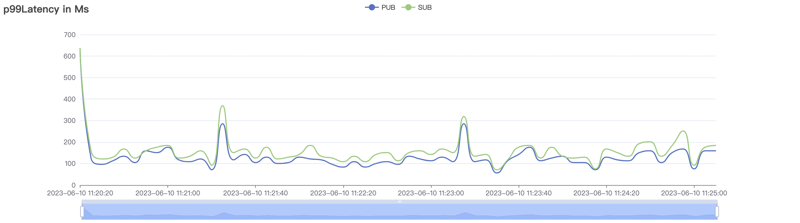
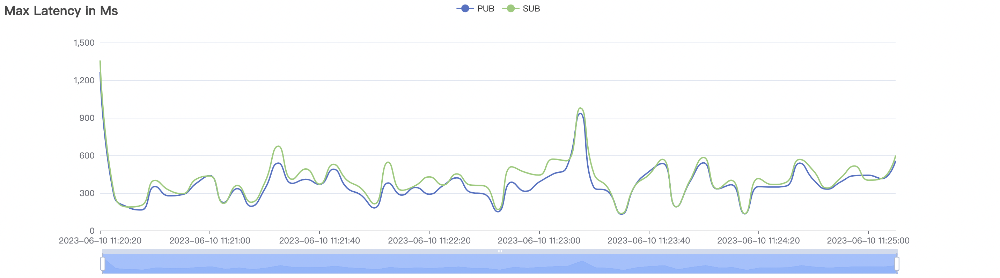

### Shared subscription scenario with cleanSession=true 

| Scenario Combination                    | QoS | MPS per Connection | Payload(byte) | Number of Connections (C)   | Total Messages per Second | Average Response Time (ms) | P99 Response Time (ms) | CPU |
|-------------------------|-----|--------|---------------|--------|--------|----------|-----------|-----|
| 40k_400_qos0_p1024_1mps | 0   | 1      | 1024          | 400.4k | 40k    | 0.32     | 3.40      | 18% |
| 40k_400_qos1_p1024_1mps | 1   | 1      | 1024          | 400.4k | 40k    | 0.61     | 6.81      | 19% |
| 40k_400_qos2_p1024_1mps | 2   | 1      | 1024          | 400.4k | 40k    | 0.81   | 7.06    | 23% |

##### Graphs for the 40k_400_qos2_p1024_1mps Scenario:

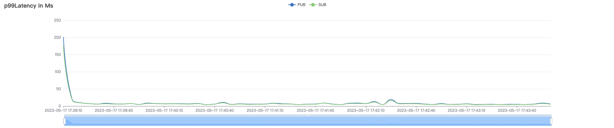
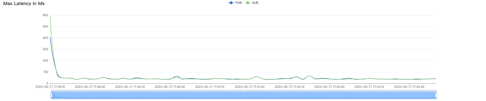

### Shared subscription scenario cleanSession=false

| Scenario Combination                  | QoS | MPS per Connection | Payload(byte) | Number of Connections (C)   | Total Messages per Second | Average Response Time (ms) | P99 Response Time (ms) | CPU |
|-----------------------|-----|--------|---------------|--------|--------|----------|-------|-----|
| 5k_50_qos0_p1024_1mps | 0   | 1      | 1024          | 5050   | 5k     | 7.22     | 30.38 | 7%  |
| 5k_50_qos1_p1024_1mps | 1   | 1      | 1024          | 5050 | 5k     | 6.79     | 27.23 | 7%  |
| 5k_50_qos2_p1024_1mps | 2   | 1      | 1024          | 5050 | 5k     | 16.24     | 56.56      | 7%  |

##### Graphs for the 5k_50_qos2_p1024_1mps Scenario:

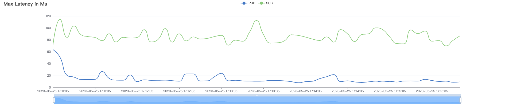

### fanOut scenario with cleanSession=true 

A small number of clients act as Publishers, and a large number of clients subscribe to the same topic as Subscribers, forming a scenario in which each message is broadcast by a massive fanOut.

| Scenario Combination              | QoS  | MPS per Connection | Payload(byte) | PubNumber of Connections (C) | Number of Sub connections | Publish m/s | Subscribe m/s | Average Response Time (ms) | P99 Response Time (ms) | CPU  |
| --------------------- | ---- | --------- | ------------- | ---------- | --------- | ---------- | ---------- | -------------- | ------------- | ---- |
| 1_1k_qos1_p32_1mps    | 1    | 1         | 32            | 1          | 1k        | 1          | 1k         | 6              | 18            | 4%   |

##### Graphs for the 1_1k_qos1_p32_1mps Scenario:

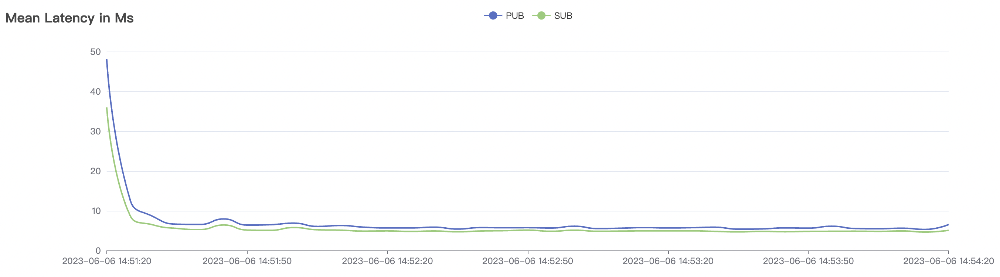
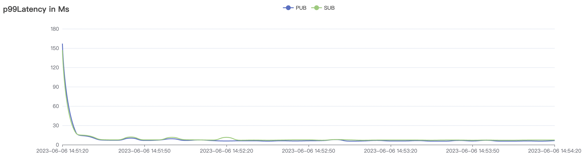
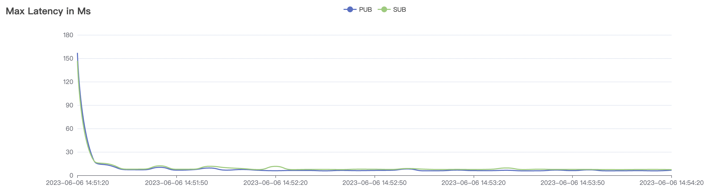

### Low-frequency Scenario with cleanSession=false 1v1

#### QoS 0 Scenario

| Scenario Combination                | QoS  | MPS per Connection | Payload(byte) | Number of Connections (C) | Total Messages per Second | Average Response Time (ms) | P99 Response Time (ms) | CPU  |
| ----------------------- | ---- | --------- | ------------- | ------- | --------- | -------------- | ------------- | ---- |
| 1k_1k_qos0_p32_1mps     | 0    | 1         | 32            | 2k      | 1k        | 1.3            | 2.2           | 6%   |
| 1k_1k_qos0_p1024_1mps   | 0    | 1         | 1024          | 2k      | 1k        | 1.4            | 2.3           | 6%   |
| 5k_5k_qos0_p32_1mps     | 0    | 1         | 32            | 10k     | 5k        | 2.7            | 5.2           | 18%  |
| 5k_5k_qos0_p1024_1mps   | 0    | 1         | 1024          | 10k     | 5k        | 3.0            | 6.5           | 18%  |
| 10k_10k_qos0_p32_1mps   | 0    | 1         | 32            | 20k     | 10k       | 9.6            | 29            | 26%  |
| 10k_10k_qos0_p1024_1mps | 0    | 1         | 1024          | 20k     | 10k       | 21             | 63            | 26%  |

##### Graphs for the 10k_10k_qos0_p32_1mps Scenario:

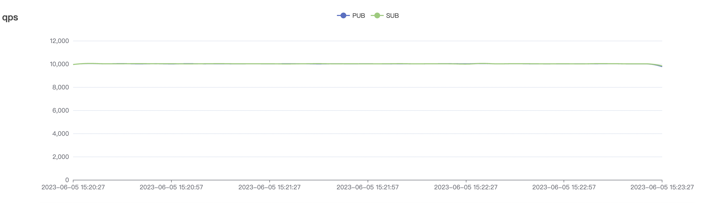

##### Graphs for the 10k_10k_qos0_p1024_1mps Scenario:

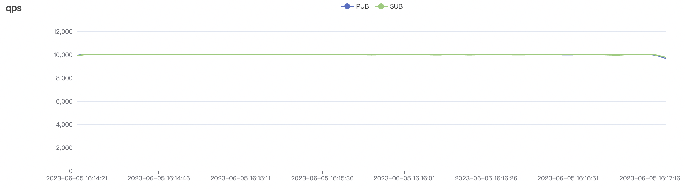

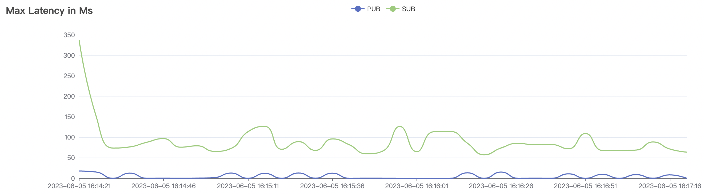

#### QoS 1 Scenario

| Scenario Combination                | QoS  | MPS per Connection | Payload(byte) | Number of Connections (C) | Total Messages per Second | Average Response Time (ms) | P99 Response Time (ms) | Resident Memory | CPU  |
| ----------------------- | ---- | --------- | ------------- | ------- | --------- | -------------- | ------------- | -------- | ---- |
| 1k_1k_qos1_p32_1mps     | 1    | 1         | 32            | 2k      | 1k        | 1.4            | 2.3           |          | 8%   |
| 1k_1k_qos1_p1024_1mps   | 1    | 1         | 1024          | 2k      | 1k        | 1.4            | 2.3           |          | 8%   |
| 5k_5k_qos1_p32_1mps     | 1    | 1         | 32            | 10k     | 5k        | 3.2            | 7.0           |          | 20%  |
| 5k_5k_qos1_p1024_1mps   | 1    | 1         | 1024          | 10k     | 5k        | 3.1            | 7.6           |          | 20%  |
| 10k_10k_qos1_p32_1mps   | 1    | 1         | 32            | 20k     | 10k       | 13             | 30            |          | 30%  |
| 10k_10k_qos1_p1024_1mps | 1    | 1         | 1024          | 20k     | 10k       | 49             | 117           |          | 30%  |

##### Graphs for the 10k_10k_qos1_p32_1mps Scenario:

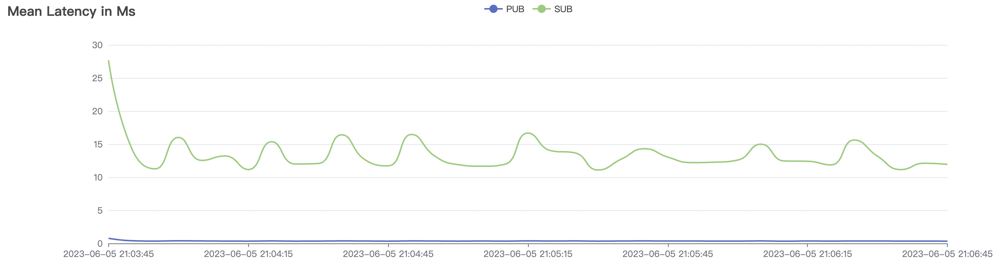
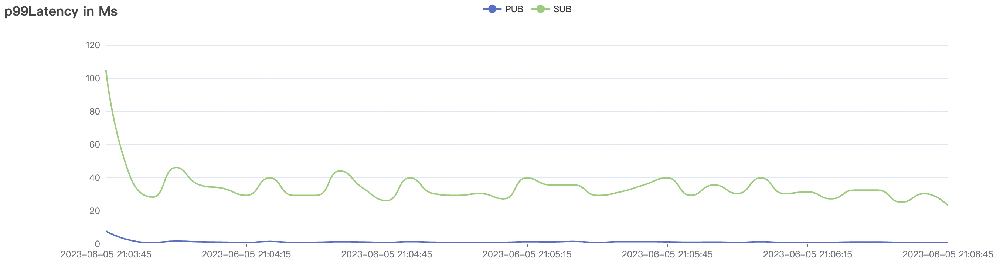

##### Graphs for the 10k_10k_qos1_p1024_1mps Scenario:

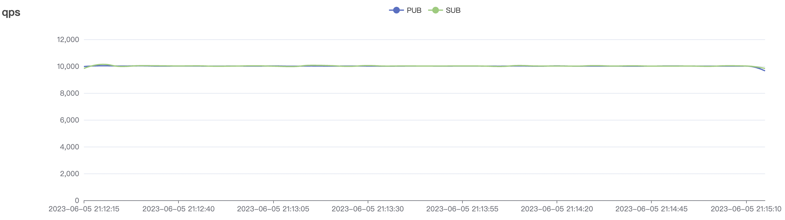
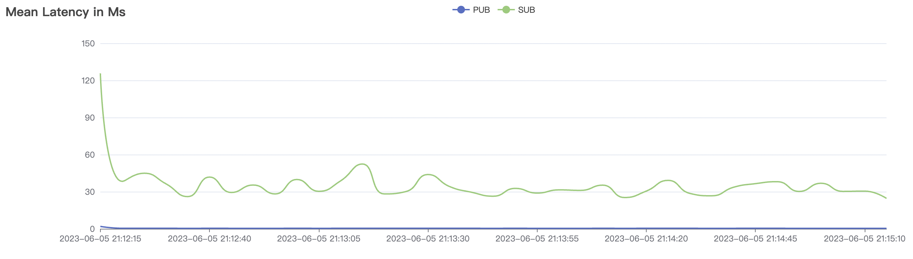
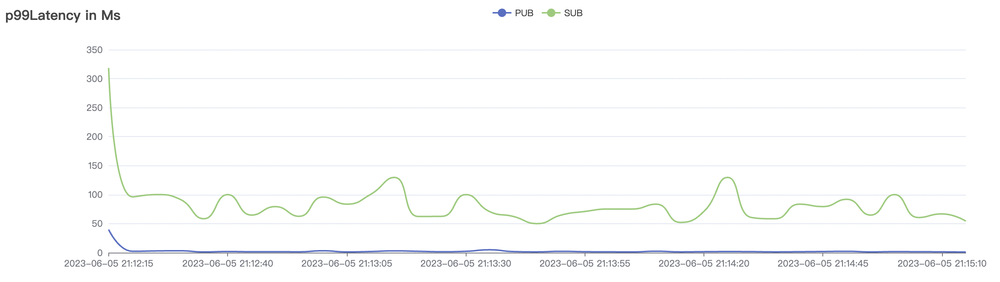
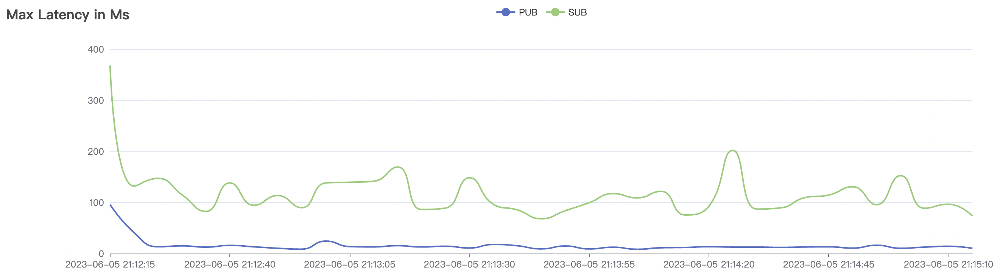

#### QoS 2 Scenario

| Scenario Combination              | QoS  | MPS per Connection | Payload(byte) | Number of Connections (C) | Total Messages per Second | Average Response Time (ms) | P99 Response Time (ms) | CPU  |
| --------------------- | ---- | --------- | ------------- | ------- | --------- | -------------- | ------------- | ---- |
| 1k_1k_qos2_p32_1mps   | 2    | 1         | 32            | 2k      | 1k        | 1.6            | 2.8           | 8%   |
| 1k_1k_qos2_p1024_1mps | 2    | 1         | 1024          | 2k      | 1k        | 1.7            | 3.0           | 8%   |
| 5k_5k_qos2_p32_1mps   | 2    | 1         | 32            | 10k     | 5k        | 3.8            | 8.3           | 22%  |
| 5k_5k_qos2_p1024_1mps | 2    | 1         | 1024          | 10k     | 5k        | 8.2            | 40            | 22%  |
| 7k_7k_qos2_p32_1mps   | 2    | 1         | 32            | 14k     | 7k        | 9.6            | 28            | 24%  |
| 7k_7k_qos2_p1024_1mps | 2    | 1         | 1024          | 14k     | 7k        | 15             | 50            | 24%  |

##### Graphs for the 7k_7k_qos2_p32_1mps Scenario:

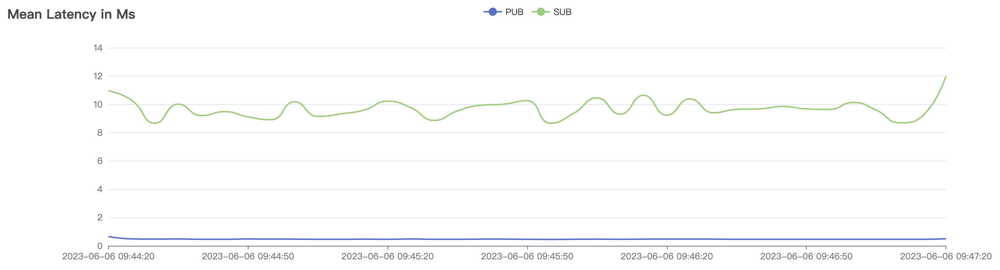

##### Graphs for the 7k_7k_qos2_p1024_1mps Scenario:

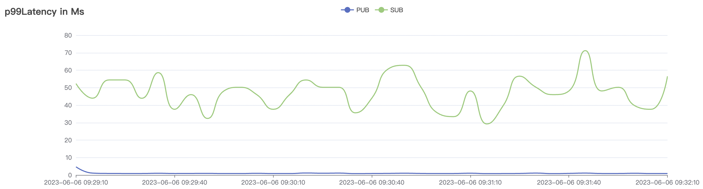

### High-frequency Scenario with cleanSession=false 1v1

#### QoS 0 Scenario

| Scenario Combination                 | QoS  | MPS per Connection | Payload(byte) | Number of Connections (C) | Total Messages per Second | Average Response Time (ms) | P99 Response Time (ms) | Resident Memory | CPU  |
| ------------------------ | ---- | --------- | ------------- | ------- | --------- | -------------- | ------------- | -------- | ---- |
| 20_20_qos0_p32_50mps     | 0    | 50        | 32            | 40      | 1k        | 11             | 96            |          | 8%   |
| 20_20_qos0_p1024_50mps   | 0    | 50        | 1024          | 40      | 1k        | 21             | 117           |          | 8%   |
| 100_100_qos0_p32_50mps   | 0    | 50        | 32            | 200     | 5k        | 23             | 84            |          | 14%  |
| 100_100_qos0_p1024_50mps | 0    | 50        | 1024          | 200     | 5k        | 28             | 92            |          | 14%  |
| 200_200_qos0_p32_50mps   | 0    | 50        | 32            | 400     | 10k       | 47             | 113           |          | 18%  |
| 200_200_qos0_p1024_50mps | 0    | 50        | 1024          | 400     | 10k       | 58             | 130           |          | 18%  |
| 300_300_qos0_p32_50mps   | 0    | 50        | 32            | 600     | 15k       | 67             | 142           |          | 22%  |
| 300_300_qos0_p1024_50mps | 0    | 50        | 1024          | 600     | 15k       | 90             | 184           |          | 22%  |

##### Graphs for the 300_300_qos0_p32_50mps Scenario:

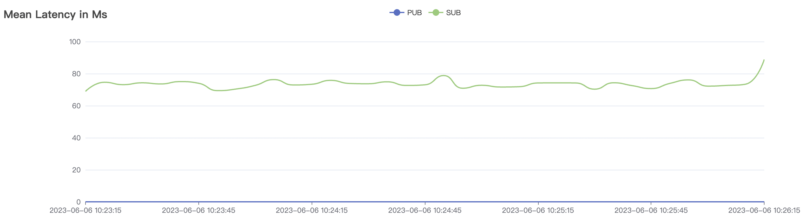

##### Graphs for the 300_300_qos0_p1024_50mps Scenario:

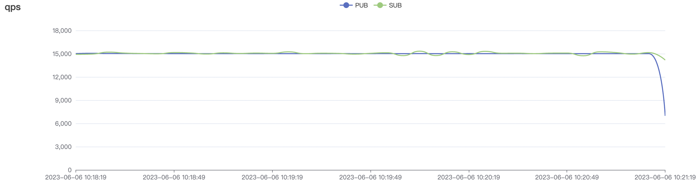

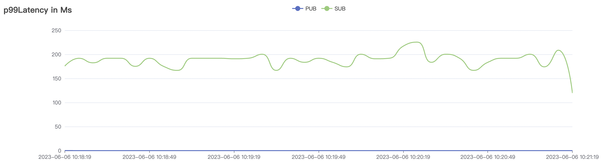

#### QoS 1 Scenario

| Scenario Combination                 | QoS  | MPS per Connection | Payload(byte) | Number of Connections (C) | Total Messages per Second | Average Response Time (ms) | P99 Response Time (ms) | Resident Memory | CPU  |
| ------------------------ | ---- | --------- | ------------- | ------- | --------- | -------------- | ------------- | -------- | ---- |
| 20_20_qos1_p32_50mps     | 1    | 50        | 32            | 40      | 1k        | 4.6            | 38            |          | 10%  |
| 20_20_qos1_p1024_50mps   | 1    | 50        | 1024          | 40      | 1k        | 20             | 117           |          | 10%  |
| 100_100_qos1_p32_50mps   | 1    | 50        | 32            | 200     | 5k        | 26             | 92            |          | 20%  |
| 100_100_qos1_p1024_50mps | 1    | 50        | 1024          | 200     | 5k        | 32             | 101           |          | 20%  |
| 200_200_qos1_p32_50mps   | 1    | 50        | 32            | 400     | 10k       | 58             | 151           |          | 23%  |
| 200_200_qos1_p1024_50mps | 1    | 50        | 1024          | 400     | 10k       | 72             | 210           |          | 23%  |
| 300_300_qos1_p32_50mps   | 1    | 50        | 32            | 600     | 15k       | 81             | 210           |          | 28%  |
| 300_300_qos1_p1024_50mps | 1    | 50        | 1024          | 600     | 15k       | 107            | 260           |          | 28%  |

##### Graphs for the 300_300_qos1_p32_50mps Scenario:

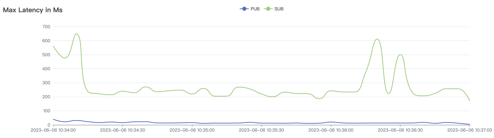

##### Graphs for the 300_300_qos1_p1024_50mps Scenario:

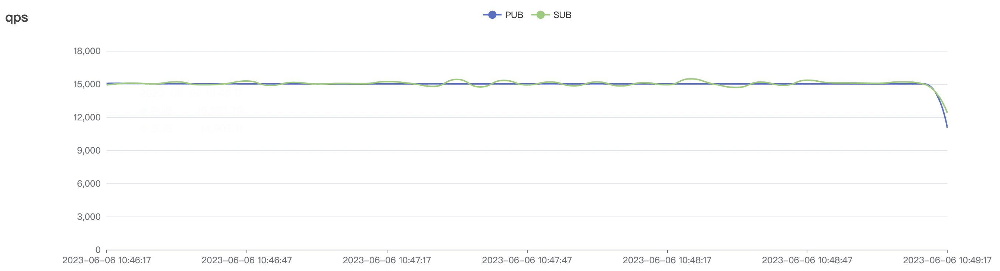
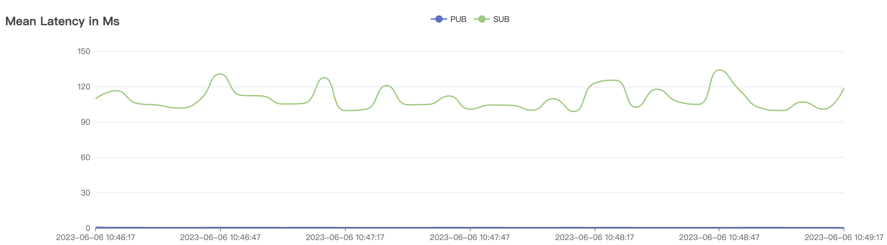
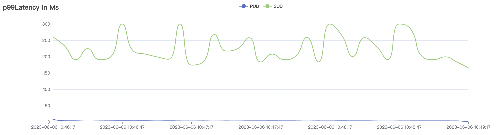

#### QoS 2 Scenario

| Scenario Combination                 | QoS  | MPS per Connection | Payload(byte) | Number of Connections (C) | Total Messages per Second | Average Response Time (ms) | P99 Response Time (ms) | Resident Memory | CPU  |
| ------------------------ | ---- | --------- | ------------- | ------- | --------- | -------------- | ------------- | -------- | ---- |
| 20_20_qos2_p32_50mps     | 0    | 50        | 32            | 40      | 1k        | 16             | 75            |          | 10%  |
| 20_20_qos2_p1024_50mps   | 0    | 50        | 1024          | 40      | 1k        | 19             | 92            |          | 10%  |
| 100_100_qos2_p32_50mps   | 0    | 50        | 32            | 200     | 5k        | 37             | 92            |          | 15%  |
| 100_100_qos2_p1024_50mps | 0    | 50        | 1024          | 200     | 5k        | 44             | 109           |          | 15%  |

##### Graphs for the 100_100_qos2_p32_50mps Scenario:

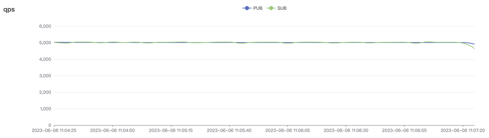

##### Graphs for the 100_100_qos2_p1024_50mps Scenario:

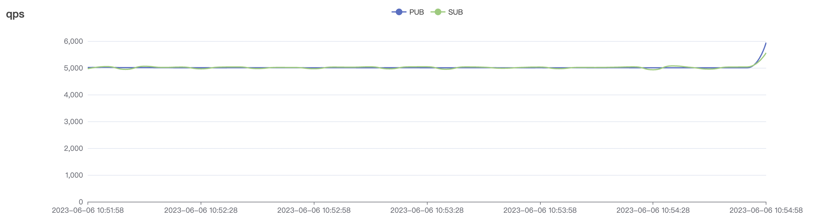
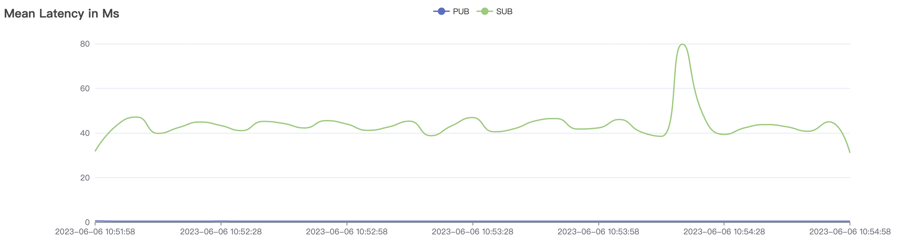
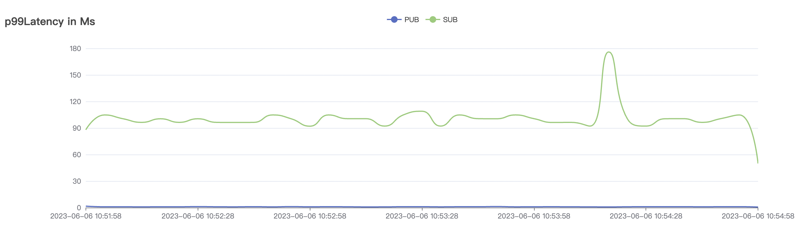
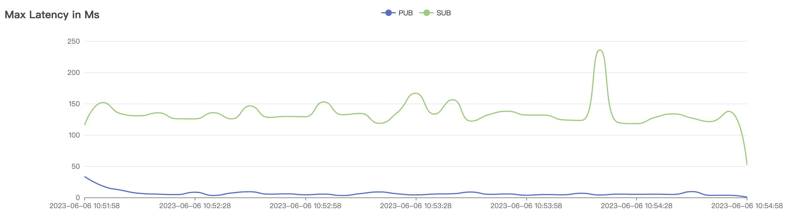

## System Parameter Optimization

The following Kernel parameters can affect the maximum number of connections that the machine hosting BifroMQ can accept.

### Memory

* vm.max_map_count: Limits the number of VMAs (Virtual Memory Areas) that a process can have. It can be increased to 221184.

### Maximum Open Files

* nofile: Specifies the maximum number of files that a single process can open.
* nr_open: Specifies the maximum number of files that can be allocated per process, usually defaulting to 1024 * 1024 = 1048576.
* file-max: Specifies the maximum number of files that the system kernel can open, with a default value of 185745.

### NetFilter Tuning

Use `sysctl -a | grep conntrack` to view the current parameters. The following parameters determine the maximum number of connections:

* net.netfilter.nf_conntrack_buckets: The size of the hashtable buckets that record connection entries.
    * Modification command: `echo 262144 > /sys/module/nf_conntrack/parameters/hashsize`
* net.netfilter.nf_conntrack_max: The maximum number of entries in the hashtable, generally equal to nf_conntrack_buckets * 4.
* net.nf_conntrack_max: Same as net.netfilter.nf_conntrack_max.
* net.netfilter.nf_conntrack_tcp_timeout_fin_wait: Default 120s -> Recommended 30s.
* net.netfilter.nf_conntrack_tcp_timeout_time_wait: Default 120s -> Recommended 30s.
* net.netfilter.nf_conntrack_tcp_timeout_close_wait: Default 60s -> Recommended 15s.
* net.netfilter.nf_conntrack_tcp_timeout_established: Default 432000 seconds (5 days) -> Recommended 300s.

The following sysctl parameters can affect the performance of TCP channels under high load:

### Server-Side and Load Testing TCP-related Tuning

It is recommended to use the CentOS 7 environment for deployment and stress testing.

For CentOS 6, system parameter tuning is required:
* net.core.wmem_max: Maximum TCP data send window size (bytes).
  * Modification command: `echo 'net.core.wmem_max=16777216' >> /etc/sysctl.conf`
* net.core.wmem_default: Default TCP data send window size (bytes).
  * Modification command: `echo 'net.core.wmem_default=262144' >> /etc/sysctl.conf`
* net.core.rmem_max: Maximum TCP data receive window size (bytes).
  * Modification command: `echo 'net.core.rmem_max=16777216' >> /etc/sysctl.conf`
* net.core.rmem_default: Default TCP data receive window size (bytes).
  * Modification command: `echo 'net.core.rmem_default=262144' >> /etc/sysctl.conf`
* net.ipv4.tcp_rmem: Memory usage of the socket receive buffer - minimum, warning, maximum.
  * Modification command: `echo 'net.ipv4.tcp_rmem= 1024 4096 16777216' >> /etc/sysctl.conf`
* net.ipv4.tcp_wmem: Memory usage of the socket send buffer - minimum, warning, maximum.
  * Modification command: `echo 'net.ipv4.tcp_wmem= 1024 4096 16777216' >> /etc/sysctl.conf`
* net.core.optmem_max: The maximum buffer size (in bytes) allowed for each socket.
  * Modification command: `echo 'net.core.optmem_max = 16777216' >> /etc/sysctl.conf`
* net.core.netdev_max_backlog: The length of the queue into which network device places requests.
  * Modification command:`echo 'net.core.netdev_max_backlog = 16384' >> /etc/sysctl.conf`

After making the modifications, use `sysctl -p` and restart the server for them to take effect.