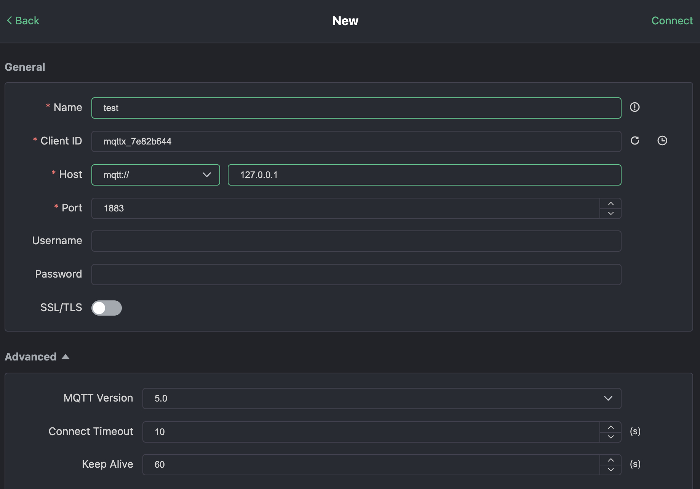

Below are the steps to quickly verify the basic MQTT functionality of BifroMQ using MQTTX.

1. Visit https://mqttx.app/ to download MQTTX and install it.
2. Open MQTTX and click on “New Connection” or the “+” sign on the left sidebar to create a new connection configuration.

3. Fill in the required fields:
    * Name: Name of this configuration. You can choose any name.
    * ClientID: Client ID, which you can set manually or generate randomly using the button on the right. It must contain characters “a-z”, “0-9”, “_”, “-”, and cannot exceed 128 bytes. It should be in UTF8 encoding and must be unique.
    * Host: Connection address. Start with the protocol prefix (mqtt:// for TCP, mqtts:// for TLS/SSL, or wss:// for WSS) followed by the domain name that accesses the BifroMQ server.
    * Port: Connection port. Choose the appropriate port based on the protocol prefix. Default ports are TCP: 1883, TLS/SSL: 1884, WSS: 443.
    * Username & Password: Enter the username and password you possess, or leave them blank if your BifroMQ installation is for testing only.
    * MQTT Version: Select 3.1, 3.1.1, 5.0

4. After correctly entering the connection configuration, click 'Connect' in the top right corner to connect to the server. 
5. Subscribe to a topic: Click on the “New Subscription” button in the top left corner and enter the topic in the pop-up dialog box. 

6. Publish a message: In the message send/receive interface, enter the same topic you subscribed to in the bottom right corner. Choose the default QoS 0, type your message content, and click the send button to publish.

7. Once the message is successfully sent, you should see the sent message appear on the right side of the interface. 