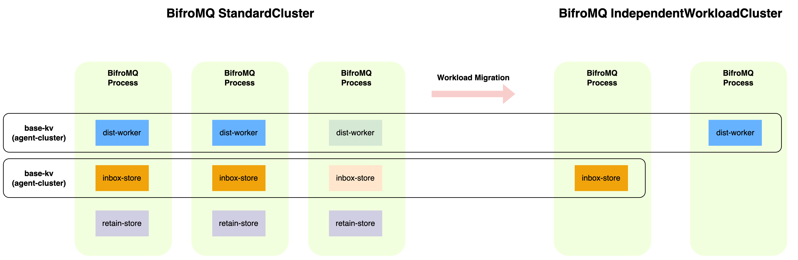

BifroMQ employs a decentralized clustering approach, where MQTT protocol workloads are distributed across independent sub-clusters, each dedicated to specific functions. This design is built upon two foundational layers: the Underlay
Cluster and the Overlay Cluster, offering clarity and decoupled architecture for enhanced scalability and fault tolerance.

## Underlay Cluster

The Underlay Cluster forms the backbone of BifroMQ's cluster system. This layer
ensures high availability by eliminating single points of failure and maintaining accurate and timely cluster topology consistency.

#### Key Features:

- **Decentralized Construction**: Facilitates cluster formation without reliance on traditional registration centers, minimizing operational risks.
- **Failure Detection and Auto-Eviction**: Enhances cluster reliability through proactive failure detection and swift membership information synchronization.
- **Split-Brain Recovery**: Incorporates mechanisms to recover from network partitions, maintaining cluster integrity and consistency.

## Overlay Cluster

Built atop the Underlay Cluster, the Overlay Cluster, or Agent Cluster, focuses on specific functional services, leveraging the foundational cluster for membership management and inter-node communication. It simplifies deployment and
operational processes, automatically forming clusters to support stateless RPC services and stateful services built on distributed KV storage engines.

## Deployment Models

BifroMQ introduces two distinct deployment models to cater to various operational requirements and workload scenarios:

### Standard Cluster

[StandardCluster](../04_cluster/1_standardcluster.md) integrates all functional modules within a single process, streamlining configuration and deployment akin to a 'SharedNothing' architecture. While this model simplifies scaling, it
offers limited"
fine-tuning" capabilities for resource allocation across different modules.

### IndependentWorkload Cluster(Will be provided in later version)

The IndependentWorkloadCluster model allows for the deployment of each module as an independent process. This provides greater flexibility, precise resource management, and the ability to adapt more
dynamically to business demands, facilitating a smooth transition from StandardCluster to a more granular deployment approach.
